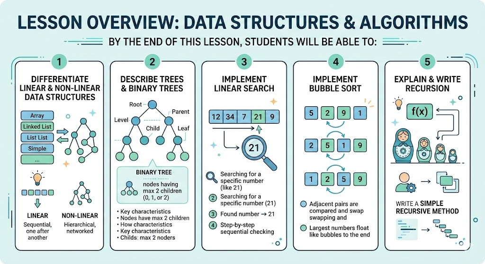

# [3.5] Data Structures and Algorithms (Part 2)

## Lesson Overview

## Dependencies
- [Self Studies](./studies.md)
- [Lesson](./lesson.md)
- [Assignment](./assignment.md)
- [Slide Deck](./slides.md)

## Lesson Objectives
* **Differentiate** between linear and non-linear data structures
* **Describe** the structure and characteristics of Trees and Binary Trees
* **Implement** Linear Search to locate elements in an array
* **Implement** Bubble Sort to arrange array elements in ascending order
* **Explain** what recursion is and write a simple recursive method

## Lesson Plan

| Duration | What | How or Why |
|----------|------|------------|
| 10 min | Warm up | Recap Lesson 3.4 — review linear data structures and Big O concepts |
| 15 min | Part 1: Non-Linear Data Structures | Introduce hierarchical vs sequential structure; comparison table and diagram |
| 20 min | Part 2: Trees | Explain terminology and visual structure; code-along with SimpleTree; activity |
| 20 min | Part 3: Binary Trees | Extend tree concept to left/right children; code-along with SimpleBinaryTree |
| 10 min | Break | — |
| 25 min | Part 4: Searching | Introduce Big O notation; teach Linear Search with code-along; activity |
| 25 min | Part 5: Sorting | Introduce Bubble Sort with diagram; code-along; activity |
| 25 min | Part 6: Recursion | Explain base case and recursive case; code-along Factorial and Sum; activity |
| 10 min | Wrap up | Recap all 6 topics, preview assignment, Q&A |
| **Total** | | **160 min — allows ~20 min buffer for questions and pacing** |