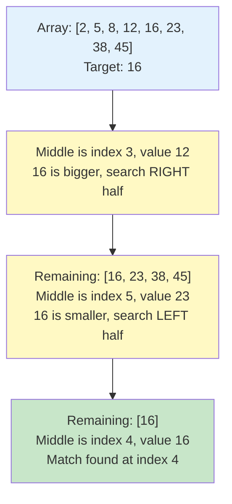
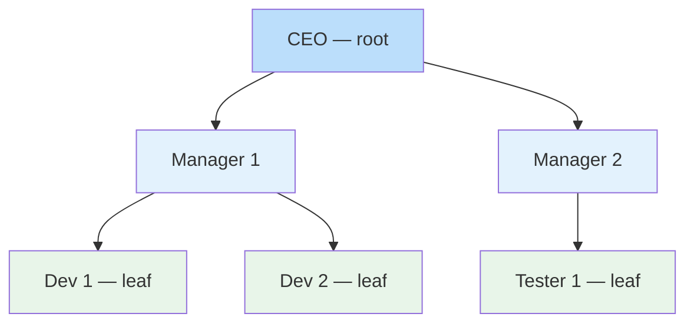
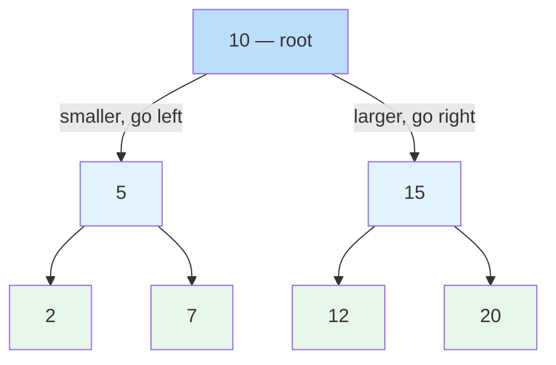

# Lesson 3.5: Searching, Sorting and Non-Linear Data Structures

## Lesson Overview

In Lesson 3.4 you learned how to **store** data. This lesson is about what you do with it — how to find it, how to order it, and how to represent data that a flat list cannot express.

The focus throughout is on **judgement, not implementation**. You will read the classic algorithms rather than grind through writing them, because the real skill in this job is knowing which structure to reach for and roughly what it costs. By the end you will understand what Java is actually doing when you call `Collections.sort()`, why `TreeMap` is always sorted, and why the same idea that powers a Binary Search Tree also powers the vector databases behind modern RAG systems.

**Module:** 3.5
**Duration:** 2 hours
**Prerequisites:** Lesson 3.4 (Data Structures and Algorithms Part 1)

---

## Lesson Objectives

By the end of this lesson, students will be able to:

- Use Big-O notation as vocabulary to describe and compare the cost of an operation.
- Explain Linear Search and Binary Search, and choose correctly between them.
- Explain why sorting is expensive, and why you should never hand-write a sort.
- Describe the two algorithms Java actually uses to sort, and why it needs two.
- Describe Trees, Binary Trees, and Binary Search Trees, and how a BST powers `TreeMap` and `TreeSet`.
- Explain why an unbalanced tree destroys performance, and how Java prevents it.
- Connect the "discard half the search space" idea to vector search in AI systems.

---

## Lesson Outline

| # | Topic | Time |
|---|-------|------|
| 1 | Big-O as vocabulary | 5 min |
| 2 | Linear Search | 5 min |
| 3 | Binary Search | 10 min |
| 4 | Counting the steps | 10 min |
| 5 | Bubble Sort, and what we are deliberately not teaching | 10 min |
| 6 | What Java actually uses | 15 min |
| 7 | Trees and Binary Trees | 12 min |
| 8 | Binary Search Trees, TreeMap and TreeSet | 20 min |
| 9 | The BST hiding inside HashMap | 5 min |
| 10 | Activity: the tree that goes wrong | 10 min |
| 11 | Where this shows up in AI engineering | 10 min |
| 12 | Summary and wrap | 8 min |

Timings are approximate. The session runs about two hours including questions.

---

## Part 1: Big-O as Vocabulary

Before anything else, four pieces of vocabulary. You will hear these in every technical interview you ever sit, so learn them as language, not as mathematics.

**Big-O notation describes how the work grows as the data grows.** That is all it is. It ignores constants and hardware and asks one question: if I give this ten times more data, what happens?

| Notation | Name | What it means in practice | Example |
|----------|------|---------------------------|---------|
| **O(1)** | Constant | The size of the data does not matter at all | `HashMap.get()` |
| **O(log n)** | Logarithmic | Each step discards half the remaining data | Binary Search, `TreeMap.get()` |
| **O(n)** | Linear | You touch every element once | Linear Search, a single `for` loop |
| **O(n²)** | Quadratic | A loop inside a loop | Bubble Sort |

The practical reading:

- **O(1)** and **O(log n)** scale to essentially any dataset. Do not worry about them.
- **O(n)** is usually fine, and is often unavoidable.
- **O(n²)** is where systems die. Ten times the data means a hundred times the work.

> **Worth noting:** There is no mathematics to memorise here. Read each row as "if I give this ten times more data, what happens?" and that is the whole of it. You only need these four terms to mean something to you when they come up later in this lesson, and in interviews.

---

## Part 2: Linear Search

An **algorithm** is a step-by-step procedure for solving a problem. We start with the most common problem of all: finding something.

A **Linear Search** checks each element in turn until it finds the target or runs out of elements.

- Works on **any** data, sorted or not.
- Best case: the element is first — one check.
- Worst case: the element is last or missing — every element is checked.
- Cost: **O(n)**.

```java
public class LinearSearchDemo {
  public static void main(String[] args) {
    int[] numbers = {4, 8, 15, 16, 23, 42};
    int target = 15;
    boolean found = false;

    for (int i = 0; i < numbers.length; i++) {
      if (numbers[i] == target) {
        System.out.println("Element found at index: " + i);
        found = true;
        break;
      }
    }

    if (!found) {
      System.out.println("Element not found in the array.");
    }
  }
}
```

**Output:**
```
Element found at index: 2
```

The `break` matters. Without it the loop keeps running after the element is found, doing work for no reason. That is the single most common beginner bug in this pattern.

---

## Part 3: Binary Search

**Binary Search** is dramatically faster, but it comes with one strict condition: **the data must already be sorted.**

Instead of checking every element, it looks at the middle and throws away half the remaining data — then repeats.

**How it works:**
1. Look at the middle element.
2. If it matches the target, you are done.
3. If the target is smaller, search the left half.
4. If the target is larger, search the right half.
5. Repeat until found, or until nothing is left.

```java
public class BinarySearchDemo {
  public static void main(String[] args) {
    int[] numbers = {2, 5, 8, 12, 16, 23, 38, 45}; // must be sorted
    int target = 16;

    int left = 0;
    int right = numbers.length - 1;
    boolean found = false;

    while (left <= right) {
      int middle = (left + right) / 2;

      if (numbers[middle] == target) {
        System.out.println("Element found at index: " + middle);
        found = true;
        break;
      } else if (numbers[middle] < target) {
        left = middle + 1;   // search the right half
      } else {
        right = middle - 1;  // search the left half
      }
    }

    if (!found) {
      System.out.println("Element not found.");
    }
  }
}
```

**Output:**
```
Element found at index: 4
```



> **Important:** Binary Search on unsorted data does not throw an error. It silently returns the wrong answer. Always confirm your data is sorted first.

In practice you would call `Arrays.binarySearch(numbers, target)` rather than write this. We are reading it so that the *idea* — halve the problem at every step — is in your head, because it comes back three more times in this lesson.

> **Worth noting:** Follow the diagram one arrow at a time and say to yourself at each step: *and now half the data is gone.* That single phrase is the spine of this entire lesson. It comes back in sorting, in trees, and at the very end in vector search.

---

## Part 4: Counting the Steps

Forget the theory. Just count.

| Number of records | Linear Search, worst case | Binary Search, worst case |
|-------------------|--------------------------|--------------------------|
| 100 | up to 100 checks | 7 checks |
| 1,000 | up to 1,000 checks | 10 checks |
| 1,000,000 | up to 1,000,000 checks | 20 checks |
| 1,000,000,000 | up to 1,000,000,000 checks | **30 checks** |

A billion records. Thirty checks.

Every check removes half of what remains, so going from a million records to a billion records — a thousand times more data — costs you ten extra steps. That is what **O(log n)** means, and it is the reason the notation is worth knowing.

This is the payoff for keeping data sorted. Sorting has a cost, which we will look at next, but if you search that data repeatedly you earn it back many times over.

> **Worth noting:** Before you read the right-hand column, guess. Most people guess somewhere in the thousands for a billion records. The gap between your guess and the real answer is the reason this notation is worth knowing at all.

---

## Part 5: Bubble Sort, and What We Are Deliberately Not Teaching

Sorting arranges data into order. It matters because so many other operations — Binary Search included — depend on it.

**Bubble Sort** is the simplest sorting algorithm to understand. It compares each pair of neighbouring elements and swaps them if they are the wrong way round. After each full pass, the largest remaining value has moved into place at the end.

```java
public class BubbleSortDemo {
  public static void main(String[] args) {
    int[] numbers = {5, 3, 8, 4, 2};
    int n = numbers.length;

    for (int i = 0; i < n - 1; i++) {
      for (int j = 0; j < n - i - 1; j++) {
        if (numbers[j] > numbers[j + 1]) {
          int temp = numbers[j];
          numbers[j] = numbers[j + 1];
          numbers[j + 1] = temp;
        }
      }
    }

    System.out.print("Sorted array: ");
    for (int num : numbers) {
      System.out.print(num + " ");
    }
  }
}
```

**Output:**
```
Sorted array: 2 3 4 5 8
```

Look at the shape of the code, not the detail. A **loop inside a loop**. That is O(n²), and here is what it costs:

| Number of items | Roughly how many comparisons |
|-----------------|------------------------------|
| 5 | about 25 |
| 100 | about 10,000 |
| 1,000 | about 1,000,000 |

Double the data, quadruple the work. This is why nobody sorts real data this way.

### What we are deliberately not covering

> A traditional data structures course would have you implement merge sort, quicksort, insertion sort, linked lists, stacks and AVL trees from scratch. We are deliberately not doing that.
>
> Those exercises exist to train you for a world where you write these yourself, and you will not. Java's implementations are the product of decades of tuning by specialists, and hand-rolling your own is a code review failure, not a flex. What matters is that you can look at a problem, know which structure to reach for, and know roughly what it costs. That judgement is the skill. The implementation is a solved problem.
>
> If you want the practice for interview preparation, the optional exercises are posted separately. They are genuinely useful for that purpose and genuinely useless for production work. Know which one you are doing.

---

## Part 6: What Java Actually Uses

In Lesson 3.4 you sorted a list like this:

```java
Collections.sort(products);
products.sort(Comparator.comparing(Product::price));
```

One line, and it worked. So what is running underneath? Not Bubble Sort. Java uses **two** different, heavily optimised algorithms, and which one you get depends on what you are sorting.

### For primitives — `int[]`, `double[]`, `char[]` — Dual-Pivot Quicksort

Standard Quicksort picks one value as a pivot and splits the data into "smaller than" and "larger than" groups, then repeats on each group. Notice that this is the same instinct as Binary Search: split the problem, then recurse.

Java's version picks **two** pivots and splits into three groups instead of two. Fewer passes, fewer comparisons, better use of the processor cache. It was contributed to the JDK in 2009 and measurably beat the previous implementation.

### For objects — `List<Product>`, `String[]` — TimSort

TimSort is built on a practical observation: real-world data is rarely random. It usually contains stretches that are already in order — timestamps, IDs, alphabetised names. TimSort finds those stretches, called **runs**, and merges them intelligently instead of sorting from scratch.

On data that is already sorted, TimSort finishes in a single pass. It was designed for Python in 2002 and adopted by Java in Java 7.

### Two words worth unpacking
 
Both descriptions above lean on a term we have not defined. Neither needs a full algorithm to make sense.
 
**A pivot is just a value you split around.** Take `[7, 62, 40, 15, 88]` and pick `40` as the pivot. Everything smaller goes left, everything larger goes right:
 
```
[7, 15]   40   [62, 88]
```
 
Nothing is sorted yet. But `7` will never again be compared against `88`, because they are now in different groups. You have cut the problem into two smaller problems, and you repeat on each side. That is the halving idea again, arriving from a different direction.
 
Java's version picks two pivots instead of one, producing three groups rather than two — smaller, middle, larger — which is why it takes fewer passes.
 
**Merging is combining two already-sorted lists into one.** Walk both from the front and always take the smaller of the two front items:
 
```
[2, 9]  and  [4, 6]
 
take 2  →  2
take 4  →  2, 4
take 6  →  2, 4, 6
take 9  →  2, 4, 6, 9
```
 
One pass through both lists, and no comparison is ever wasted. This works *only* because both inputs were already sorted.
 
That is TimSort's whole insight. Real data arrives containing stretches that are already in order, so TimSort finds those stretches and merges them rather than sorting from nothing. It starts the job halfway done.
 
> **How far to take this:** You do not need to be able to implement either algorithm, and you will not be asked to. Knowing what a pivot is and what merging means is enough to read the documentation, understand a stack trace, and hold your own in a technical conversation. If you want the full algorithms, they are well covered everywhere — but as Part 5 said, writing your own is not the job.
 

### Why two algorithms?

Because they optimise for different things, and the difference is **stability**.

A stable sort preserves the original relative order of equal elements. If two products both cost $20, a stable sort guarantees they come out in the same order they went in. TimSort guarantees this. Quicksort does not.

For objects that matters enormously — it is what lets you sort by price, then sort by category, and still have the price order preserved within each category. For primitives it is meaningless: one `5` is indistinguishable from another `5`, so there is nothing to preserve.

| | Dual-Pivot Quicksort | TimSort |
|--|---------------------|---------|
| Used for | Primitives (`int[]`, `double[]`) | Objects (`List<T>`, `String[]`) |
| Stable? | No | Yes |
| Best case | Fast on random data | Single pass on sorted data |
| Called via | `Arrays.sort(int[])` | `Collections.sort()`, `List.sort()` |

**The practical takeaway:** always use `Arrays.sort()` or `Collections.sort()`. Understanding Bubble Sort tells you *why* sorting costs something. It does not mean you should ever write your own.

> **Try this yourself:** Take a list of records, sort it by one field, then sort the result by a second field. Print it after each step. You will see the first ordering surviving inside the second — that is stability doing real work, and it is a technique you will use constantly.

---

## Part 7: Trees and Binary Trees

In Lesson 3.4 we covered two of the three categories of data structure. Here is the full picture:

| Category | Structures | How data is stored |
|----------|-----------|-------------------|
| **Linear** | Array, ArrayList, LinkedList, ArrayDeque | Sequentially, one after another |
| **Hash-Based** | HashMap, HashSet and variants | By hash code, no sequence |
| **Non-Linear** | Tree, Binary Tree | Hierarchically, as parent and child |

In a **non-linear structure** the elements are not in a sequence. They are connected to express relationships — most commonly a parent-and-child hierarchy. This suits data a flat list cannot represent naturally: an organisation chart, a folder structure, a product category hierarchy.

A **Tree** is made of **nodes** connected by **edges**. The node at the top is the **root**, a node with no children is a **leaf**, and any node plus everything beneath it is a **subtree**.



### You have been using a tree all module

Open any repository you have worked on in this module and run:

```bash
git cat-file -p HEAD
```

Git does not store your project as a list of files. Every commit points to a **tree object**, which represents a directory. That tree points to more tree objects for subdirectories, and to **blob objects** for file contents. It is a hierarchy of nodes and edges — a tree in exactly the sense we have just defined.

And the commits themselves form a second non-linear structure. Each commit points back to its parent, which is why `git log --graph` draws branches and merges rather than a straight line, and why a merge commit is simply a node with two parents.

So when you branched, merged and resolved conflicts in Module 3, you were navigating a non-linear data structure. You just were not calling it that.

### Trees in Java

Unlike `ArrayList` or `HashMap`, **Java has no built-in `Tree` class**. There is nothing to import.

This is deliberate. Trees come in many forms — Binary Tree, Binary Search Tree, AVL Tree, Red-Black Tree — each with different rules, and there is no sensible default. If you genuinely need a tree, you build it yourself with a class whose objects hold references to their children.

What Java does give you is `TreeMap` and `TreeSet`, which use a tree internally to keep data sorted. You never touch the tree; you just get sorted data.

### Binary Trees

A **Binary Tree** adds exactly one restriction: each node may have **at most two children**, called the left child and the right child.

That single restriction makes the structure predictable, and predictable structures are easy to write fast algorithms against. On its own a Binary Tree says nothing about *which* values go left or right. Add one rule about that, and you get something far more powerful.

---

## Part 8: Binary Search Trees, TreeMap and TreeSet

A **Binary Search Tree** (BST) is a Binary Tree with one extra rule, holding at every node:

> **Left child is smaller than the parent. Right child is larger than the parent.**



**Searching for 7:**
1. Start at the root, 10. 7 is smaller, so go left.
2. Now at 5. 7 is larger, so go right.
3. Now at 7. Found it.

Three steps in a tree of seven values — and at every step, **half the remaining tree was discarded.**

That should feel familiar. It is exactly what Binary Search did to a sorted array, except here the structure itself enforces the ordering, so there is no sorting step at all. Same O(log n), no sort required.

| | Binary Tree | Binary Search Tree |
|--|-------------|-------------------|
| Children | At most 2 | At most 2 |
| Rule on values | None | Left smaller, right larger |
| Searching | Must check every node — O(n) | Half discarded each step — O(log n) |
| Used for | General hierarchical data | Fast search and permanently sorted data |

### This is how TreeMap and TreeSet work

Now the connection back to Lesson 3.4.

```java
TreeMap<String, Integer> scores = new TreeMap<>();
scores.put("Charlie", 78);
scores.put("Alice", 85);
scores.put("Bob", 92);

System.out.println(scores);
// {Alice=85, Bob=92, Charlie=78} — sorted, without you doing anything
```

When you call `scores.get("Bob")`, Java walks a Binary Search Tree. It compares "Bob" against the value at each node and goes left or right, discarding half the remaining entries every time.

This explains behaviour you already saw in 3.4:

- **Why TreeMap is always sorted** — the tree maintains order as you insert. There is no sort step, ever.
- **Why `firstKey()` and `lastKey()` exist and are fast** — they are simply the leftmost and rightmost nodes.
- **Why TreeMap is slightly slower than HashMap** — HashMap jumps straight to a location in O(1); TreeMap walks down through several nodes in O(log n). Slower, but you get ordering for free.

### Self-balancing: the detail that makes it work

Java does not use a plain BST. It uses a **Red-Black Tree**, which is a BST that rebalances itself as you insert.

Why that matters becomes obvious in the next activity, so hold the question for now. The short version: without rebalancing, certain insertion orders produce a tree with no branching at all, and every performance guarantee collapses. The Red-Black rules prevent that automatically. You never see any of it — you just get reliable O(log n) whatever order your data arrives in.

---

## Part 9: The BST Hiding Inside HashMap

One more connection, and it ties both lessons together.

`HashMap` works by turning a key into a hash code and using that to jump straight to a bucket. Usually one bucket holds one entry, which is why lookup is O(1).

But hash codes can collide. Two different keys can land in the same bucket, and then Java has to store several entries there. Historically it stored them in a linked list, which meant that in the worst case — many keys colliding, sometimes deliberately, as in a hash collision denial-of-service attack — lookup degraded from O(1) all the way to O(n).

Since **Java 8**, when a single bucket exceeds eight entries, Java converts that bucket from a linked list into a **Red-Black Tree**. The worst case improves from O(n) to O(log n).

So the `HashMap` you have been using since Lesson 3.4 contains, in its worst moments, exactly the structure we just spent twenty minutes on.

> **The detail, if you want it:** Java converts a bucket to a tree once it holds eight entries, converts it back down at six, and only does either when the map has at least 64 buckets. You will never need to tune this. It is worth knowing only because it shows that hashing, trees, balancing and Big-O are one story rather than four separate topics.

---

## 👨‍💻 Part 10 Activity: The Tree That Goes Wrong **(10 minutes)**

Pen and paper. No code for this one.

**Part A.** Insert these values into an empty Binary Search Tree, in this order:

`50, 30, 70, 20, 40, 60, 80`

Rules: the first value becomes the root. For every value after that, start at the root, go left if it is smaller and right if it is larger, until you reach an empty spot.

1. Draw the tree.
2. How many comparisons does it take to find `40`?
3. Trace the path for `65`. What happens, and how do you know it is not in the tree?

**Part B — the important half.** Now start again with an empty tree and insert:

`10, 20, 30, 40, 50`

4. Draw it. What shape do you get?
5. How many comparisons to find `50` now? Compare that to Part A.
6. **Discussion:** you have just built a tree that is really a linked list. Every search is O(n). What kind of real data arrives already sorted, and how often do you think that happens?

> **Where this is going:** Part B is the important half. When you answer question 6, think about where your data actually comes from — database rows arrive ordered by ID, log entries arrive by timestamp, imported CSVs are usually sorted already. Sorted input is not an edge case, it is the normal case. That is precisely why Java uses a self-balancing Red-Black Tree rather than a plain BST: the failure you just drew is common enough that it had to be engineered away.

---

## Part 11: Where This Shows Up in AI Engineering

Everything in this lesson has been one idea: **discard most of the search space at every step.** That idea is not a Java curiosity. It is the reason modern AI systems can retrieve anything at all.

When you build a RAG system, your documents become **embeddings** — vectors, often 1,536 numbers each. Retrieval means finding the vectors closest to your query vector. If you have ten million embeddings, comparing the query against every one of them is a linear search: O(n), and far too slow to sit inside a chat response.

So vector databases — Pinecone, Chroma, Weaviate, pgvector, FAISS — do not compare against everything. They use an index called **HNSW: Hierarchical Navigable Small World.**

The mental model is an express train network:

- The **top layer** has very few stops, spaced far apart. One hop covers enormous distance.
- Each **layer down** has more stops and finer spacing.
- The **bottom layer** contains every vector.

A search starts at the top, travels to roughly the right region in a few long hops, then drops down a layer and refines. Each layer discards most of what remains — exactly what Binary Search did to an array and what a BST does to a tree, generalised from two branches to a graph of many.

| Java | Vector database |
|------|-----------------|
| Sorted array + Binary Search | Flat index + brute force scan |
| Binary Search Tree | HNSW graph |
| Red-Black self-balancing | Index tuning parameters (`M`, `efConstruction`) |
| O(log n) lookup | Approximate nearest neighbour search |

There is one honest difference worth naming. A BST lookup is **exact** — you either find the key or you prove it is absent. HNSW is **approximate**: it very occasionally misses a true nearest neighbour in exchange for being orders of magnitude faster. Every vector database exposes a knob controlling that trade-off. When you tune retrieval quality in a RAG pipeline, that knob is what you are actually turning, and now you know what it is doing underneath.

> **How far to take this:** You do not need to know how an HNSW graph is constructed to work with one, and nobody expects you to at this stage. What matters is that you recognise the pattern when you meet it in a vector database's documentation. If you want to go further, the HNSW paper by Malkov and Yashunin is the original source and is readable.

---

## Lesson Summary

| Concept | What it is | Key point |
|---------|-----------|-----------|
| Big-O | Vocabulary for how work grows with data | O(1) and O(log n) scale; O(n²) does not |
| Linear Search | Check each element in turn | O(n), works on any data |
| Binary Search | Discard half at each step | O(log n), requires sorted data |
| Bubble Sort | Swap neighbours repeatedly | O(n²), teaching tool only |
| Java's real sorting | Dual-Pivot Quicksort and TimSort | Two algorithms, because objects need stability |
| Tree | Hierarchical nodes and edges | No built-in Java class; Git is one |
| Binary Search Tree | Left smaller, right larger | Powers TreeMap and TreeSet |
| Red-Black Tree | A self-balancing BST | Prevents the degenerate straight-line case |
| HNSW | Layered graph index | The same halving idea, applied to vector search |

### Putting It Together

| What you need to do | Best choice | Why |
|--------------------|-------------|-----|
| Find something by key | HashMap | O(1) direct lookup, no searching involved |
| Search unsorted data | Linear Search | No alternative without sorting first |
| Search sorted data repeatedly | `Arrays.binarySearch()` | O(log n), tiny even on huge datasets |
| Keep data permanently sorted | TreeMap or TreeSet | A Red-Black BST maintains order for you |
| Sort a list of objects | `Collections.sort()` | TimSort, stable, already optimised |
| Sort an array of numbers | `Arrays.sort()` | Dual-Pivot Quicksort |
| Represent a hierarchy | Build it yourself with classes | Java provides no general Tree |
| Search millions of embeddings | Vector DB with an HNSW index | Same halving idea, approximate and fast |

### Key Takeaways

- Big-O is vocabulary, not mathematics. Learn the four common cases and what they mean at scale.
- Binary Search on unsorted data fails silently — a wrong answer, not an error.
- Sorting is expensive because of nested comparisons, which is why you never hand-write it.
- Java uses two sorting algorithms because objects need stability and primitives do not.
- Trees represent hierarchy. Java has no general Tree class, but you have been using Git's trees all module.
- A BST discards half the tree at every step, which is what makes TreeMap and TreeSet efficient.
- Sorted input would ruin a plain BST, so Java self-balances with a Red-Black Tree. Since Java 8, HashMap uses one too.
- The same idea scales all the way up to vector search in production AI systems.

---

## Optional Practice (Not Assessed)

For anyone preparing for technical interviews, where these do still come up:

1. Implement Linear Search on `{3, 7, 11, 19, 24, 35, 48, 56, 72, 90}` to find `35`, counting the checks.
2. Implement Binary Search on the same array for the same target, counting the checks. Compare.
3. Search for `100` with both. Observe how each one terminates.
4. Implement Bubble Sort on `{45, 12, 89, 33, 67}`. Expected output: `12 33 45 67 89`.
5. Run your Binary Search on the sorted result to find `45`.

These are interview preparation, not production practice. Use `Arrays.sort()` and `Arrays.binarySearch()` in real work, always.

---

**End of Lesson 3.5**