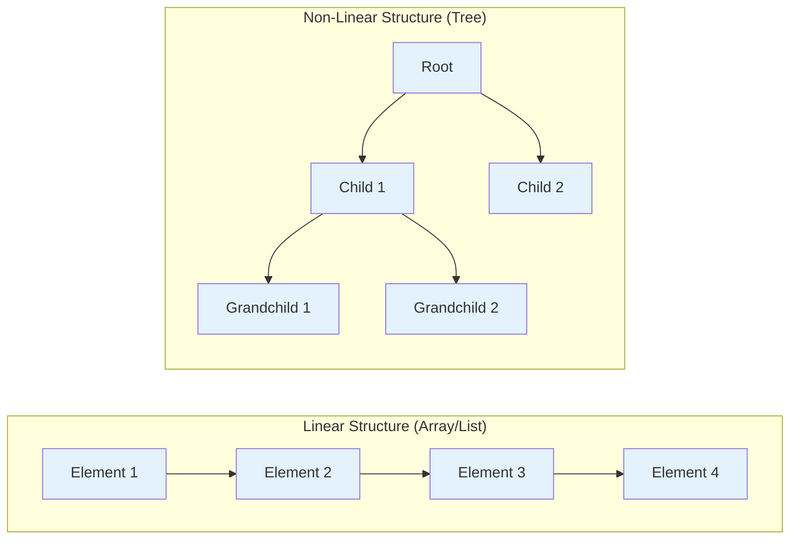
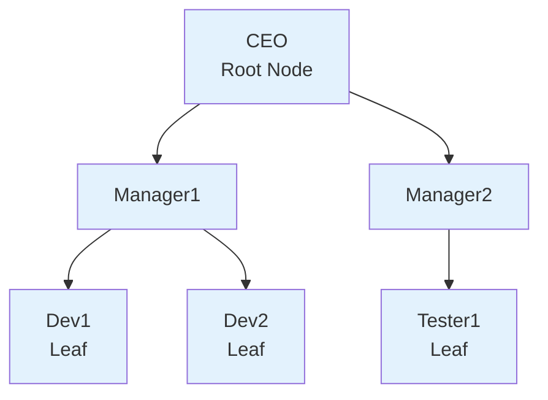
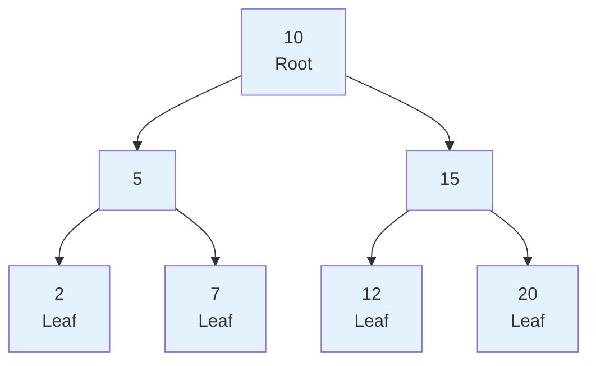
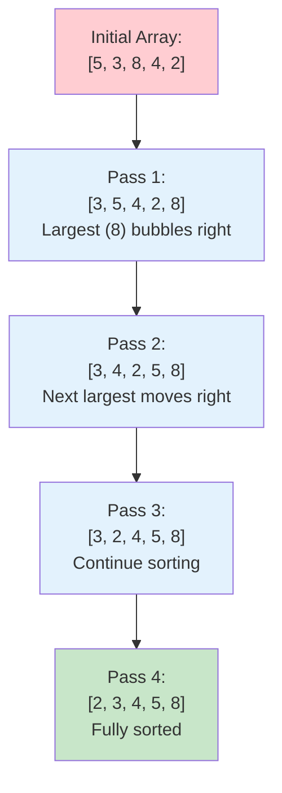

# Lesson 3.5: Data Structures and Algorithms (Part 2)

## Lesson Overview
This lesson continues the exploration of data structures and algorithms in Java. Students will learn about **non-linear data structures**, focusing on **Trees** and **Binary Trees**, which organise data in a hierarchical way rather than sequentially. The lesson also introduces fundamental algorithms such as **Searching**, **Sorting**, and **Recursion**, which form the foundation of efficient problem-solving in programming. By the end of this lesson, learners will understand how data can be represented beyond simple lists and how algorithms process such data efficiently.

**Module:** 3.5
**Duration:** 3 hours
**Prerequisites:** Completion of Lesson 3.4 (Linear Data Structures and Algorithms Part 1)

---

## Lesson Objectives
By the end of this lesson, students will be able to:
- Differentiate between linear and non-linear data structures.
- Describe the structure and characteristics of Trees and Binary Trees.
- Implement Linear Search to locate elements in an array.
- Implement Bubble Sort to arrange array elements in ascending order.
- Explain what recursion is and implement a simple recursive method.

---

## Connecting Back to Lesson 3.4

In Lesson 3.4 we covered how to **store and organise data** using linear and hash-based structures. Now in Part 2 we focus on **processing that data** — how do you find it, how do you sort it, and how do you represent complex relationships that go beyond simple lists.

| From 3.4 | What We Do With It in 3.5 |
|----------|--------------------------|
| Array | Linear Search, Bubble Sort |
| ArrayList | Linear Search |
| HashMap | Already O(1) lookup — no search algorithm needed |
| TreeMap | Uses tree structure internally — connects to Trees concept |

---

## Part 1: Introduction to Non-Linear Data Structures

In the previous lesson, we explored **linear data structures** such as arrays, lists, and hash-based collections, where elements are stored **sequentially** — one after another.
However, not all problems fit neatly into a linear order. Some require **hierarchical** or **network-like** relationships between data elements.

This is where **non-linear data structures** come in.

### What Are Non-Linear Data Structures?

In a **non-linear data structure**, data elements are **not arranged sequentially**. Instead, they are connected in a way that represents relationships like parent–child or node–connection.
This allows more complex data relationships and efficient solutions to problems like hierarchical representation (organisation charts, file systems) or path finding (maps, graphs).

| Feature | Linear Structure | Non-Linear Structure |
|----------|------------------|----------------------|
| Arrangement | Sequential (one after another) | Hierarchical or network-based |
| Traversal | One path (start to end) | Multiple paths possible |
| Example Structures | Array, LinkedList, ArrayList | Tree, Binary Tree, Graph |
| Use Case | Storing ordered data | Representing relationships |



---

## Part 2: Trees

A **Tree** is a non-linear data structure that represents data in a **hierarchical** manner. It is made up of **nodes** connected by **edges**. Each node can have **zero or more child nodes**, forming parent–child relationships.

Think of a tree like a **family tree** or a **folder structure** on your computer:
- The **root** is the starting point (e.g., "C Drive").
- Each **folder** can contain subfolders (children).
- The **leaves** are folders or files that don't have anything inside.

---

### Basic Terms in a Tree

| Term | Description |
|------|--------------|
| **Root Node** | The topmost node in a tree. There is only one root. |
| **Parent Node** | A node that has one or more children. |
| **Child Node** | A node that descends from another node. |
| **Leaf Node** | A node that has no children. |
| **Edge** | The connection between two nodes. |
| **Subtree** | A smaller section of a tree that can be treated as a tree itself. |
| **Level** | The depth or generation of nodes starting from the root. |

---

### Visual Representation

Here's an example of a simple tree representing an organisation structure:



- **CEO** → Root node
- **Manager1**, **Manager2** → Child nodes of CEO
- **Dev1**, **Dev2**, **Tester1** → Leaf nodes (no children)

---

### Trees in Java

Unlike HashMap, HashSet, ArrayList and other structures from Lesson 3.4, **Java does not provide a built-in Tree class** in the Collections Framework. There is no `Tree` or `BinaryTree` you can simply import and use.

Java does provide **TreeMap** and **TreeSet** — but these use a tree structure (Red-Black Tree) **internally** to keep data sorted. As a developer you never interact with the tree structure underneath — you just use them as a sorted Map or Set.

If you need a true tree structure in a real project, you build it yourself using classes and OOP — where each node becomes an object with references to its children.

> 💡 **Key Takeaway:** Trees are a concept. Java gives you tree-powered tools (TreeMap, TreeSet) but not a raw tree to work with directly. Understanding the concept is what matters here.

---

### Key Takeaways
- A **Tree** is a hierarchical, non-linear structure made of nodes and edges.
- It starts with a **root node** and expands into **subtrees**.
- Trees are widely used in real-world applications such as file systems, databases, and organisational hierarchies.
- Java does not have a built-in Tree class — TreeMap and TreeSet use trees internally but don't expose the structure directly.

---

## Part 3: Binary Trees

A **Binary Tree** is a special type of tree in which each node can have **at most two children** — a **left child** and a **right child**.
This restriction makes binary trees simpler to implement and efficient for operations such as searching and sorting.
Binary Trees are one of the most widely used data structures in computer science. They form the foundation of structures such as **Binary Search Trees**, **Heaps**, and **Syntax Trees** in compilers.

---

### Characteristics of a Binary Tree
- Each node can have **0, 1, or 2 children**.
- The topmost node is called the **root node**.
- Every node connects downward to its children through **left** and **right** links.
- Nodes with no children are called **leaf nodes**.
- Binary trees can grow in depth (levels), where each level doubles the number of potential nodes.

---

### Visual Example

Below is a simple representation of a binary tree that stores numeric values:



- 10 is the root.
- 5 and 15 are the children of 10.
- 2, 7, 12, and 20 are leaf nodes.
- Every node has at most two children.

---

### Binary Trees in Java

Just like general Trees, **Java has no built-in Binary Tree class**. The Collections Framework does not include one because trees have too many variations — Binary Tree, Binary Search Tree, AVL Tree, Red-Black Tree — each with different rules and use cases. Java could not standardise a single implementation so it was left to developers to build their own.

> 💡 **Real World Connection:** When you use `TreeMap` or `TreeSet` in Java, a Red-Black Tree (a self-balancing Binary Tree) is working behind the scenes. You get the benefits of a tree — sorted data, O(log n) performance — without building it yourself.

---

### Key Takeaways
- A Binary Tree is a hierarchical structure where each node has at most two children — left and right.
- Binary Trees are the foundation of Binary Search Trees, Heaps, and Expression Trees.
- Java has no built-in Binary Tree — developers implement their own using OOP when needed.
- TreeMap and TreeSet are powered by Binary Trees internally.

---

## Part 4: Algorithms — Searching

An **algorithm** is a step-by-step procedure to solve a problem. In the context of data structures, algorithms are used to perform operations such as searching, sorting, and traversing data efficiently.

---

### What Is Searching?

Searching is the process of checking whether a particular element exists in a collection and, if it does, determining its position or index.

---

### Linear Search

A **Linear Search** checks each element in a list one by one until the desired element is found or the list ends. It is the simplest searching algorithm and works on both sorted and unsorted data.

- **Best case:** Element found at the first position — O(1)
- **Worst case:** Element not found or at the last position — O(n)
- **Use case:** Works on any dataset, sorted or unsorted

```java
public class LinearSearchDemo {
  public static void main(String[] args) {
    int[] numbers = {4, 8, 15, 16, 23, 42};
    int target = 15;
    boolean found = false;

    for (int i = 0; i < numbers.length; i++) {
      if (numbers[i] == target) {
        System.out.println("Element found at index: " + i);
        found = true;
        break;
      }
    }

    if (!found) {
      System.out.println("Element not found in the array.");
    }
  }
}
```

**Output:**
```
Element found at index: 2
```

---

### 👨‍💻 Activity: Implement Linear Search **(5 minutes)**

- Create a new file `SearchDemo.java`
- Declare an array of 8 integers: `{2, 5, 8, 12, 16, 23, 38, 45}`
- Use **Linear Search** to find the number `16` — print the index when found
- Try searching for a number that doesn't exist (e.g., `99`) and print `"Not found"`

---

### Key Takeaways
- **Linear Search** checks each element one by one — O(n) worst case.
- Simple to implement and works on any dataset.
- For fast lookups use **HashMap** — O(1). Linear Search is for when you don't have a key.

---

## Part 5: Algorithms — Sorting

Sorting is the process of arranging data in a particular order — typically ascending or descending. Efficient sorting improves the performance of other operations such as searching and data retrieval.

---

### Bubble Sort

Bubble Sort is the simplest sorting algorithm. It repeatedly compares adjacent elements and swaps them if they are in the wrong order. After each pass, the largest element "bubbles up" to the end of the list.

- **Time Complexity:** O(n²) — nested loops
- **Best Case:** List is already sorted
- **Worst Case:** List is completely unsorted
- **Use Case:** Learning and small datasets

```java
public class BubbleSortDemo {
  public static void main(String[] args) {
    int[] numbers = {5, 3, 8, 4, 2};
    int n = numbers.length;

    for (int i = 0; i < n - 1; i++) {
      for (int j = 0; j < n - i - 1; j++) {
        if (numbers[j] > numbers[j + 1]) {
          int temp = numbers[j];
          numbers[j] = numbers[j + 1];
          numbers[j + 1] = temp;
        }
      }
    }

    System.out.print("Sorted array: ");
    for (int num : numbers) {
      System.out.print(num + " ");
    }
  }
}
```

**Output:**
```
Sorted array: 2 3 4 5 8
```



---

### Other Sorting Algorithms (Awareness Only — No Coding Required)

These algorithms are faster for large datasets. You don't need to implement them today but it's important to know they exist.

| Algorithm | Time Complexity | Best For |
|------------|-----------------|----------|
| **Bubble Sort** | O(n²) | Learning and small data |
| **Selection Sort** | O(n²) | Fewer swaps needed |
| **Insertion Sort** | O(n²) | Small or partially sorted data |
| **Merge Sort** | O(n log n) | Large datasets |
| **Quick Sort** | O(n log n) average | General-purpose fast sorting |

> 💡 **Real World Note:** In production Java code, you would never write your own sort. You'd use `Collections.sort()` or `Arrays.sort()` which use highly optimised versions of these algorithms internally. Understanding Bubble Sort teaches you *why* sorting is expensive — so you appreciate what Java is doing for you.

---

### 👨‍💻 Activity: Implement Bubble Sort **(5 minutes)**

- Create a new file `SortDemo.java`
- Declare this array: `{45, 12, 89, 33, 67}`
- Sort it using **Bubble Sort** and print the result
- Expected output: `12 33 45 67 89`

---

### Key Takeaways
- **Bubble Sort** repeatedly swaps adjacent elements until sorted — O(n²).
- Nested loops are the reason for O(n²) — avoid for large datasets.
- In real projects use `Collections.sort()` or `Arrays.sort()` — built-in and optimised.

---

## Part 6: Recursion

**Recursion** is a programming technique where a method calls itself to solve a problem by breaking it into smaller versions of the same problem.

---

### The Two Rules of Recursion

Every recursive method must have exactly two things:

| Component | Description |
|-----------|-------------|
| **Base Case** | The stopping condition. When reached, the method returns without calling itself again. |
| **Recursive Case** | The method calls itself with a smaller or simpler input, moving toward the base case. |

> ⚠️ Without a base case the method calls itself forever — causing a **StackOverflowError**.

---

### Real World Connection

Think about how your OS calculates the size of a folder:
- Open folder → check all files → for each subfolder, open it and do the same thing
- Each subfolder triggers the same operation on a smaller problem
- Stops when there are no more subfolders — that's the base case

This is recursion. The same operation applied repeatedly on smaller inputs until a stopping condition is met.

---

### Example: Fibonacci Sequence

The Fibonacci sequence is a classic example where recursion maps naturally to the problem definition:

```
0, 1, 1, 2, 3, 5, 8, 13, 21, 34...
Each number = sum of the two before it
```

**Recursive Definition:**
- `fibonacci(0)` = 0 (base case)
- `fibonacci(1)` = 1 (base case)
- `fibonacci(n)` = `fibonacci(n-1)` + `fibonacci(n-2)` (recursive case)

```java
public class FibonacciDemo {

  public static int fibonacci(int n) {
    // Base cases
    if (n == 0) return 0;
    if (n == 1) return 1;

    // Recursive case — each call breaks into two smaller calls
    return fibonacci(n - 1) + fibonacci(n - 2);
  }

  public static void main(String[] args) {
    System.out.println("Fibonacci sequence:");
    for (int i = 0; i <= 10; i++) {
      System.out.print(fibonacci(i) + " ");
    }
    // Output: 0 1 1 2 3 5 8 13 21 34 55
  }
}
```

**How It Works for fibonacci(5):**
```
fibonacci(5)
  = fibonacci(4) + fibonacci(3)
  = (fibonacci(3) + fibonacci(2)) + (fibonacci(2) + fibonacci(1))
  = ... keeps breaking down until it hits base cases 0 and 1
  = 5
```

---

### The Big O Conversation

This is where it gets interesting for experienced developers:

```
fibonacci(5)  →  calls itself ~15 times
fibonacci(10) →  calls itself ~177 times
fibonacci(50) →  calls itself ~2 trillion times  ← danger zone
```

Naive recursive Fibonacci is **O(2^n)** — exponential. It recalculates the same values over and over. This is why in production code you would use **memoization** (caching results) or an iterative approach instead.

> 💡 **Key Insight:** Recursion is elegant and readable. But always ask — what is the time complexity? Fibonacci looks simple but scales terribly without optimisation. This is exactly the kind of trade-off a modern engineer needs to recognise.

---

### 👨‍💻 Activity: Practice Recursion **(5 minutes)**

Write a recursive method `sumDigits(int n)` that calculates the sum of all digits in a number.

- `sumDigits(123)` → `1 + 2 + 3` = `6`
- `sumDigits(9045)` → `9 + 0 + 4 + 5` = `18`

**Hints:**
- Base case: if `n < 10` return `n`
- Recursive case: last digit is `n % 10`, remaining number is `n / 10`

---

### Key Takeaways
- Recursion is a method calling itself with a smaller input until a base case is reached.
- Always define a base case — without it you get a **StackOverflowError**.
- Recursion is elegant for hierarchical problems but watch the time complexity.
- Naive recursive solutions can be exponentially slow — always consider the trade-off.

---

## Lesson Summary

| Concept | What It Is | Key Point |
|---------|-----------|-----------|
| Trees | Hierarchical non-linear structure | No built-in Java class — build with OOP |
| Binary Trees | Tree where each node has at most 2 children | Foundation of TreeMap and TreeSet internally |
| Linear Search | Check elements one by one | O(n) — simple but slow for large data |
| Bubble Sort | Swap adjacent elements repeatedly | O(n²) — use Collections.sort() in production |
| Recursion | Method calls itself | Always need a base case — watch time complexity |

---

## Connecting Data Structures to Algorithms

| Operation | Best Data Structure | Algorithm / Method | Time Complexity |
|-----------|--------------------|--------------------|-----------------|
| Search by value | Array / ArrayList | Linear Search | O(n) |
| Search by key | HashMap | Direct lookup `.get()` | O(1) |
| Sorted lookup | TreeMap | Internal tree traversal | O(log n) |
| Sort elements | Array | Bubble Sort / Arrays.sort() | O(n²) / O(n log n) |
| Hierarchical data | Build with OOP | Tree / Binary Tree | Varies |

---

## 🔵 Optional: Recursion — Selection Sort

> For students who finish early or want to explore further.

**Selection Sort** improves on Bubble Sort by reducing the number of swaps. Instead of comparing adjacent pairs repeatedly, it scans for the smallest element in the unsorted portion and moves it to the front in a single swap per pass.

- **Concept:** Select the smallest element and move it to its correct position.
- **Time Complexity:** O(n²) — still uses nested loops.
- **Use Case:** When minimising data movement (swaps) is important.

```java
public class SelectionSortDemo {
  public static void main(String[] args) {
    int[] numbers = {64, 25, 12, 22, 11};
    int n = numbers.length;

    for (int i = 0; i < n - 1; i++) {
      int minIndex = i;
      for (int j = i + 1; j < n; j++) {
        if (numbers[j] < numbers[minIndex]) {
          minIndex = j;
        }
      }

      int temp = numbers[minIndex];
      numbers[minIndex] = numbers[i];
      numbers[i] = temp;
    }

    System.out.print("Sorted array: ");
    for (int num : numbers) {
      System.out.print(num + " ");
    }
  }
}
```

**Output:**
```
Sorted array: 11 12 22 25 64
```

Try running this on the same array from the Bubble Sort activity — `{45, 12, 89, 33, 67}` — and confirm both algorithms produce the same sorted result.

---

**End of Lesson 3.5**