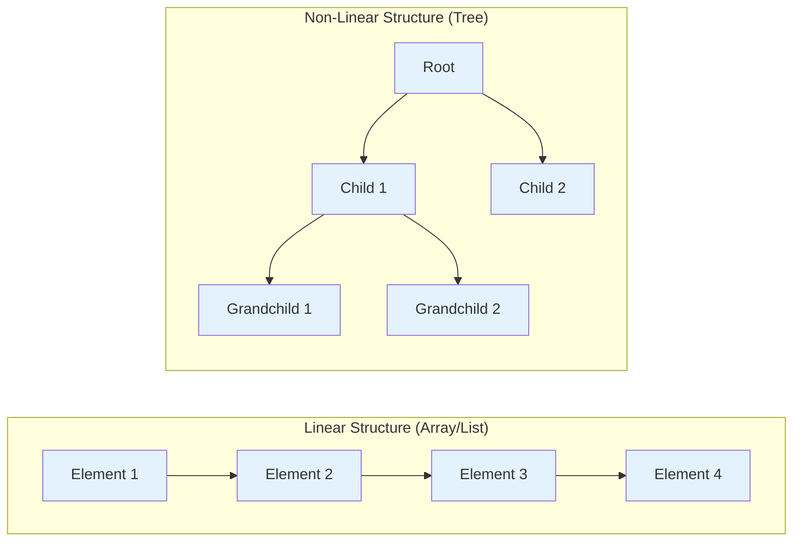
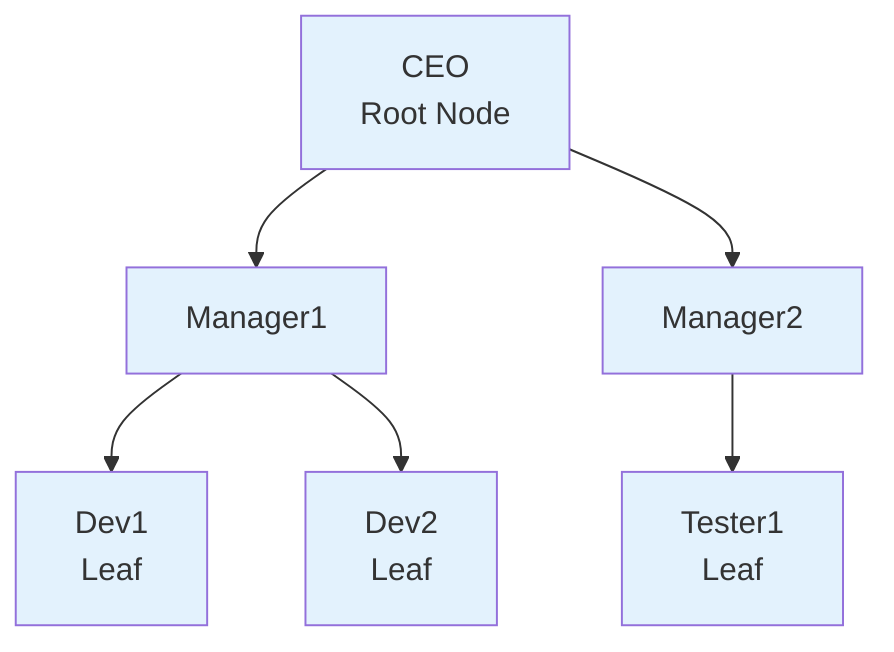
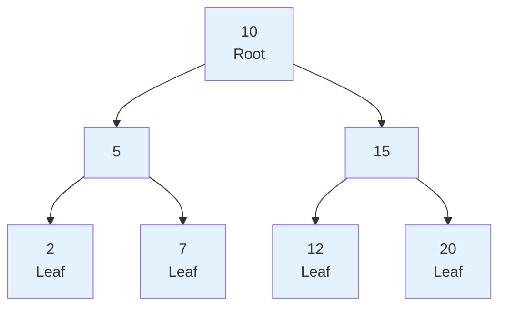
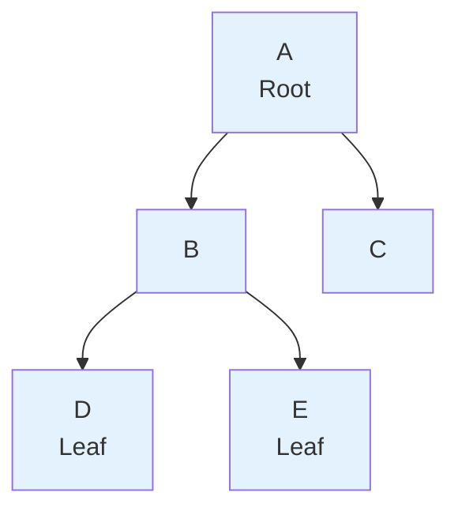
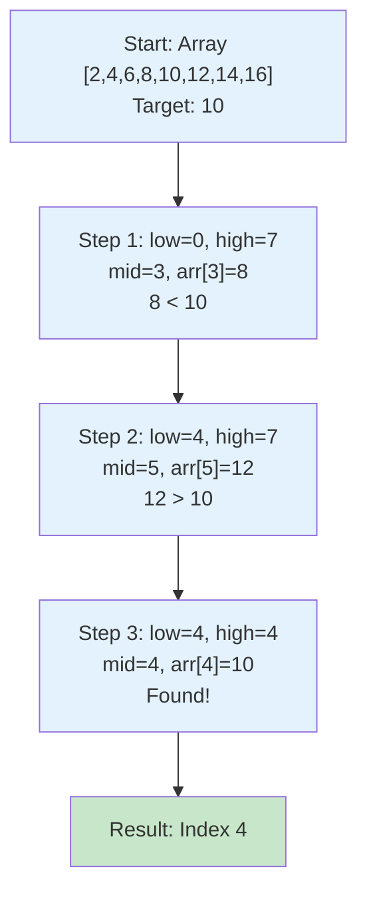
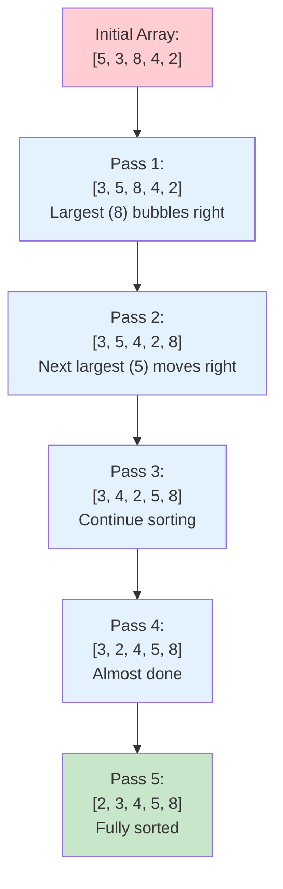

# Lesson 3.5: Data Structures and Algorithms (Part 2)

## Lesson Overview
This lesson continues the exploration of data structures and algorithms in Java. Students will learn about **non-linear data structures**, focusing on **Trees** and **Binary Trees**, which organize data in a hierarchical way rather than sequentially. The lesson also introduces fundamental algorithms such as **Searching**, **Sorting**, and **Recursion**, which form the foundation of efficient problem-solving in programming. By the end of this lesson, learners will understand how data can be represented beyond simple lists and how algorithms process such data efficiently.

**Module:** 3  
**Duration:** 3 hours  
**Prerequisites:** Completion of Lesson 3.4 (Linear Data Structures and Algorithms Part 1)

---

## Lesson Objectives
By the end of this lesson, students will be able to:
- Differentiate between linear and non-linear data structures.
- Describe the structure and characteristics of Trees and Binary Trees.
- Implement simple examples of tree traversal using recursion.
- Explain and apply basic searching and sorting algorithms.
- Understand the concept of recursion and its role in algorithm design.

---

## Part 1: Introduction to Non-Linear Data Structures

In the previous lesson, we explored **linear data structures** such as arrays, lists, and hash-based collections, where elements are stored **sequentially** — one after another.  
However, not all problems fit neatly into a linear order. Some require **hierarchical** or **network-like** relationships between data elements.  

This is where **non-linear data structures** come in.

### What Are Non-Linear Data Structures?

In a **non-linear data structure**, data elements are **not arranged sequentially**. Instead, they are connected in a way that represents relationships like parent–child or node–connection.  
This allows more complex data relationships and efficient solutions to problems like hierarchical representation (organization charts, file systems) or path finding (maps, graphs).

| Feature | Linear Structure | Non-Linear Structure |
|----------|------------------|----------------------|
| Arrangement | Sequential (one after another) | Hierarchical or network-based |
| Traversal | One path (start to end) | Multiple paths possible |
| Example Structures | Array, LinkedList, ArrayList | Tree, Binary Tree, Graph |
| Use Case | Storing ordered data | Representing relationships |



---

## Part 2: Trees

A **Tree** is a non-linear data structure that represents data in a **hierarchical** manner. It is made up of **nodes** connected by **edges**. Each node can have **zero or more child nodes**, forming parent–child relationships.

Think of a tree like a **family tree** or a **folder structure** on your computer:
- The **root** is the starting point (e.g., “C Drive”).
- Each **folder** can contain subfolders (children).
- The **leaves** are folders or files that don’t have anything inside.

---

###  Basic Terms in a Tree

| Term | Description |
|------|--------------|
| **Root Node** | The topmost node in a tree. There is only one root. |
| **Parent Node** | A node that has one or more children. |
| **Child Node** | A node that descends from another node. |
| **Leaf Node** | A node that has no children. |
| **Edge** | The connection between two nodes. |
| **Subtree** | A smaller section of a tree that can be treated as a tree itself. |
| **Level** | The depth or generation of nodes starting from the root. |

---

###  Visual Representation

Here's an example of a simple tree representing an organization structure:




- **CEO** → Root node
- **Manager1**, **Manager2** → Child nodes of CEO
- **Dev1**, **Dev2**, **Tester1** → Leaf nodes (no children)

---

###  Understanding Trees in Java (Conceptual)

Java does not provide a built-in `Tree` class, but it provides **TreeMap** and **TreeSet** which use internal tree structures (Red-Black Trees) to maintain sorted data.  
At this stage, we focus on **understanding how trees work conceptually**, rather than implementing complex versions.

Let’s simulate a simple tree using nested arrays (since classes are not yet taught):

```java
public class SimpleTree {
  public static void main(String[] args) {

    // Representing a simple organizational tree using arrays
    String root = "CEO";
    String[] level1 = {"Manager1", "Manager2"};
    String[] level2_manager1 = {"Dev1", "Dev2"};
    String[] level2_manager2 = {"Tester1"};

    System.out.println("Root Node: " + root);

    System.out.println("\nChildren of " + root + ":");
    for (String manager : level1) {
      System.out.println("  - " + manager);
    }

    System.out.println("\nChildren of Manager1:");
    for (String dev : level2_manager1) {
      System.out.println("  - " + dev);
    }

    System.out.println("\nChildren of Manager2:");
    for (String tester : level2_manager2) {
      System.out.println("  - " + tester);
    }
  }
}
```

Root Node: CEO

Children of CEO:
  - Manager1
  - Manager2

Children of Manager1:
  - Dev1
  - Dev2

Children of Manager2:
  - Tester1

This simple example demonstrates the hierarchical structure of a tree — each node may have multiple child nodes, and data is not stored sequentially but in parent–child relationships.

###  Activity: Build Your Own Tree
Write a Java program to represent a **school structure** using arrays:
- Root node: "Principal"
- Children: "Teacher1", "Teacher2"
- Each teacher has two students.
- Display all nodes in a clear hierarchical format.

---

###  Key Takeaways
- A **Tree** is a hierarchical, non-linear structure made of nodes and edges.
- It starts with a **root node** and expands into **subtrees**.
- Trees are widely used in real-world applications such as file systems, databases, and organizational hierarchies.
- In Java, conceptual tree structures can be simulated using arrays or later implemented using custom node classes once OOP is covered.

## Part 3: Binary Trees

A **Binary Tree** is a special type of tree in which each node can have **at most two children** — a **left child** and a **right child**.  
This restriction makes binary trees simpler to implement and efficient for operations such as searching and sorting.  
Binary Trees are one of the most widely used data structures in computer science. They form the foundation of structures such as **Binary Search Trees**, **Heaps**, and **Syntax Trees** in compilers.

---

### Characteristics of a Binary Tree
- Each node can have **0, 1, or 2 children**.
- The topmost node is called the **root node**.
- Every node connects downward to its children through **left** and **right** links.
- Nodes with no children are called **leaf nodes**.
- Binary trees can grow in depth (levels), where each level doubles the number of potential nodes.

---

### Visual Example

Below is a simple representation of a binary tree that stores numeric values:



- 10 is the root.
- 5 and 15 are the children of 10.
- 2, 7, 12, and 20 are leaf nodes.

Every node has at most two children.
Representing a Binary Tree in Java (Conceptual)
We will use parallel arrays to represent the parent–child relationships of a binary tree.

```java
public class SimpleBinaryTree {
  public static void main(String[] args) {

    // Representing nodes of a binary tree using arrays
    int[] nodes = {10, 5, 15, 2, 7, 12, 20};
    String[] leftChild = {"5", "2", "12", "null", "null", "null", "null"};
    String[] rightChild = {"15", "7", "20", "null", "null", "null", "null"};

    System.out.println("Binary Tree Nodes and Their Children:\n");

    for (int i = 0; i < nodes.length; i++) {
      System.out.println("Node " + nodes[i] +
                         " -> Left: " + leftChild[i] +
                         ", Right: " + rightChild[i]);
    }
  }
}
```

**Output:**
```
Binary Tree Nodes and Their Children:
Node 10 -> Left: 5, Right: 15
Node 5 -> Left: 2, Right: 7
Node 15 -> Left: 12, Right: 20
Node 2 -> Left: null, Right: null
Node 7 -> Left: null, Right: null
Node 12 -> Left: null, Right: null
Node 20 -> Left: null, Right: null
```

This approach helps visualize how binary tree nodes are connected logically through left and right links.
Later, when students learn classes, they can represent each node as an object with left and right references.

### Traversing a Binary Tree

Tree traversal means visiting every node in a specific order. The three common ways to traverse a binary tree are:

| Type | Description | Visit Order |
|------|-------------|-------------|
| **Inorder** | Visit left subtree → root → right subtree | Left → Root → Right |
| **Preorder** | Visit root → left subtree → right subtree | Root → Left → Right |
| **Postorder** | Visit left subtree → right subtree → root | Left → Right → Root |

To help understand traversal order, consider this binary tree again:



| Traversal Type | Visiting Order |
| -------------- | -------------- |
| **Inorder**    | D, B, E, A, C  |
| **Preorder**   | A, B, D, E, C  |
| **Postorder**  | D, E, B, C, A  |

### Traversal Using Recursion (Conceptual Demo)

Although recursion will be explained later in this lesson, we can conceptually describe traversal using recursive logic.
Example pseudocode for an Inorder Traversal:
```php
function inorder(node):
    if node is not null:
        inorder(node.left)
        print(node.value)
        inorder(node.right)
```

This shows the self-repeating nature of tree traversal — a perfect example of recursion.

### Activity: Explore Traversal Logic

Use pen and paper to manually list the order of nodes visited in Inorder, Preorder, and Postorder for this tree:

```css

        M
       / \
      J   S
     / \   \
    A  K    T


```
- Write down each traversal order carefully.
- Compare your answers with your peers.
- Discuss which traversal type is best suited for searching.

#### Key Takeaways

- A Binary Tree is a hierarchical structure where each node can have at most two children.
- Binary Trees are used as the basis for Binary Search Trees, Heaps, and Expression Trees.
- Traversal refers to visiting each node in a specific order — Inorder, Preorder, or Postorder.
- Understanding binary trees helps in mastering more complex algorithms such as searching and recursion.

## Part 4: Algorithms — Searching

An **algorithm** is a step-by-step procedure to solve a problem. In the context of data structures, algorithms are used to perform operations such as searching, sorting, and traversing data efficiently.  
In this section, we focus on **searching algorithms**, which are used to find the position of a specific element within a collection such as an array or a list.

---

### What Is Searching?

Searching is the process of checking whether a particular element exists in a collection and, if it does, determining its position or index.  
Different searching algorithms vary in terms of their speed and efficiency depending on the structure and size of the data.

---

#### Linear Search

A **Linear Search** (also known as a sequential search) checks each element in a list one by one until the desired element is found or the list ends.  
It is the simplest and most straightforward searching algorithm.


- Concept: Start from the first element and compare it with the target value.
- Best case: The element is found at the first position.
- Worst case: The element is not found, or it is the last one (O(n) complexity).
- Use case: Works on both sorted and unsorted lists.

```java
public class LinearSearchDemo {
  public static void main(String[] args) {
    int[] numbers = {4, 8, 15, 16, 23, 42};
    int target = 15;
    boolean found = false;

    for (int i = 0; i < numbers.length; i++) {
      if (numbers[i] == target) {
        System.out.println("Element found at index: " + i);
        found = true;
        break;
      }
    }

    if (!found) {
      System.out.println("Element not found in the array.");
    }
  }
}
```

**Output:**
```
Element found at index: 2
```

---


### Binary Search

A Binary Search is a much faster searching algorithm, but it only works on sorted data.
It repeatedly divides the search range by half, discarding the half that cannot contain the target element.

- **Concept:** Divide the list into halves, check the middle element, and narrow the range.
- **Requirement:** The list must be sorted.
- **Best case:** Middle element is the target (O(1)).
- **Worst case:** Target not found (O(log n)).
- **Use case:** Searching large sorted datasets.


Example: Binary Search in Java

```java
public class BinarySearchDemo {
  public static void main(String[] args) {
    int[] numbers = {2, 4, 6, 8, 10, 12, 14, 16};
    int target = 10;

    int low = 0;
    int high = numbers.length - 1;
    boolean found = false;

    while (low <= high) {
      int mid = (low + high) / 2;

      if (numbers[mid] == target) {
        System.out.println("Element found at index: " + mid);
        found = true;
        break;
      } else if (numbers[mid] < target) {
        low = mid + 1;
      } else {
        high = mid - 1;
      }
    }

    if (!found) {
      System.out.println("Element not found in the array.");
    }
  }
}
```

**Output:**
```
Element found at index: 4
```



#### Comparing Linear and Binary Search

| Criteria | Linear Search | Binary Search |
|-----------|----------------|----------------|
| **Data Requirement** | Works on unsorted data | Requires sorted data |
| **Approach** | Sequential checking | Divide and conquer |
| **Time Complexity** | O(n) | O(log n) |
| **Ease of Implementation** | Simple | Slightly complex |
| **When to Use** | Small or unsorted lists | Large sorted datasets |

#### Activity: Compare Linear and Binary Search

- Write a Java program to implement both Linear and Binary Search.
- Test both algorithms on an array of 10 integers (sorted and unsorted).
- Measure and print how many comparisons each method performs.
- Discuss which algorithm performs faster and why.

#### Key Takeaways:

- Searching algorithms help locate elements in a collection efficiently.
- Linear Search checks each element sequentially and works on any data set.
- Binary Search divides the search range by half and requires sorted data.
- Binary Search is faster for large data sets due to logarithmic time complexity.
- The choice of algorithm depends on the data structure and whether it is sorted.

## Part 5: Algorithms — Sorting

Sorting is the process of arranging data in a particular order — typically ascending or descending.  
Efficient sorting improves the performance of other operations such as searching and data retrieval.


### What Is Sorting?

Sorting algorithms organize the elements of a list so they can be processed or searched efficiently.  
Some algorithms are simple but slow, while others are complex yet faster on large datasets.


- **Ascending Order:** From smallest to largest (e.g., 1, 3, 5, 7)
- **Descending Order:** From largest to smallest (e.g., 7, 5, 3, 1)
- **Goal:** Reduce the time it takes to find or compare elements
- **Key Idea:** Compare elements and swap or insert them into the correct position


### Bubble Sort

Bubble Sort is the simplest sorting algorithm. It repeatedly compares adjacent elements and swaps them if they are in the wrong order.
After each pass, the largest element “bubbles up” to the end of the list.

- **Concept:** Repeatedly compare adjacent pairs and swap if needed.
- **Time Complexity:** O(n²) — because of nested loops.
- **Best Case:** When the list is already sorted.
- **Worst Case:** When the list is completely unsorted.
- **Use Case:** Educational use and small data sets.

Example: Bubble Sort in Java

```java
public class BubbleSortDemo {
  public static void main(String[] args) {
    int[] numbers = {5, 3, 8, 4, 2};
    int n = numbers.length;

    for (int i = 0; i < n - 1; i++) {
      for (int j = 0; j < n - i - 1; j++) {
        if (numbers[j] > numbers[j + 1]) {
          int temp = numbers[j];
          numbers[j] = numbers[j + 1];
          numbers[j + 1] = temp;
        }
      }
    }

    System.out.print("Sorted array: ");
    for (int num : numbers) {
      System.out.print(num + " ");
    }
  }
}
```

**Output:**
```
Sorted array: 2 3 4 5 8
```



### Selection Sort

Selection Sort improves on Bubble Sort slightly by reducing the number of swaps.
It repeatedly finds the smallest element in the unsorted portion and places it at the beginning.

- **Concept:** Select the smallest element and move it to its correct position.
- **Time Complexity:** O(n²) — still uses nested loops.
- **Best Case:** Works the same regardless of initial order.
- **Use Case:** When data movement cost is more critical than comparison cost.


Example: Selection Sort in Java

```java

public class SelectionSortDemo {
  public static void main(String[] args) {
    int[] numbers = {64, 25, 12, 22, 11};
    int n = numbers.length;

    for (int i = 0; i < n - 1; i++) {
      int minIndex = i;
      for (int j = i + 1; j < n; j++) {
        if (numbers[j] < numbers[minIndex]) {
          minIndex = j;
        }
      }

      int temp = numbers[minIndex];
      numbers[minIndex] = numbers[i];
      numbers[i] = temp;
    }

    System.out.print("Sorted array: ");
    for (int num : numbers) {
      System.out.print(num + " ");
    }
  }
}
```

**Output:**
```
Sorted array: 11 12 22 25 64
```

Other Sorting Algorithms (Brief Overview)
- **Insertion Sort:** Builds the sorted list one element at a time by comparing and inserting at the correct position. Efficient for small or nearly sorted datasets.
- **Merge Sort:** Uses the divide-and-conquer approach to split the array and merge them in sorted order. Requires recursion.
- **Quick Sort:** Similar to Merge Sort but selects a pivot element to partition the array. Very efficient on large datasets.

Comparing Sorting Algorithms
| Algorithm | Time Complexity | Space Complexity | Best For |
|------------|-----------------|------------------|-----------|
| **Bubble Sort** | O(n²) | O(1) | Teaching simplicity |
| **Selection Sort** | O(n²) | O(1) | Fewer swaps |
| **Insertion Sort** | O(n²) | O(1) | Small or partially sorted data |
| **Merge Sort** | O(n log n) | O(n) | Large datasets, stable sorting |
| **Quick Sort** | O(n log n) average | O(log n) | General-purpose fast sorting |

#### Activity: Implement Sorting
- Write a Java program that implements both Bubble Sort and Selection Sort.
- Use the same array `{45, 12, 89, 33, 67}` for both algorithms.
- Print the sorted array and compare the number of iterations for each.
- Discuss which algorithm is easier to understand and why.

#### Key Takeaways
- Sorting organizes data to make searching and comparison faster.
- Bubble Sort repeatedly swaps adjacent elements until the list is sorted.
- Selection Sort finds the smallest element and moves it to its correct position.
- Merge Sort and Quick Sort use recursion and are faster for large datasets.
- Choosing the right sorting algorithm depends on data size and performance needs.

---


