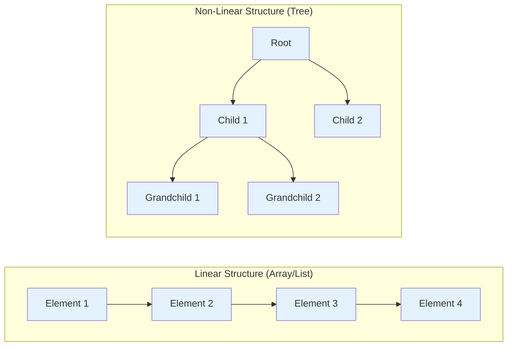
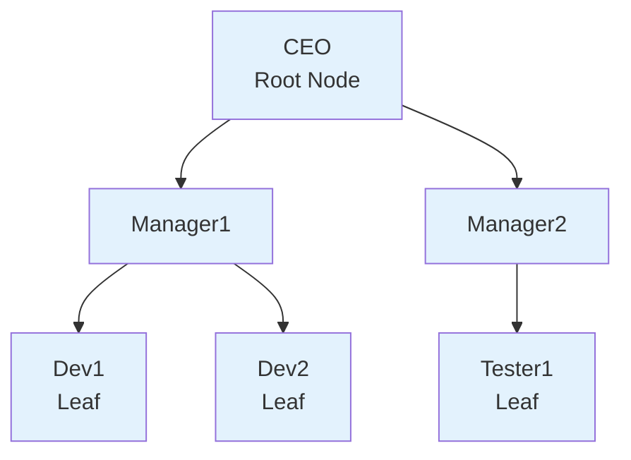
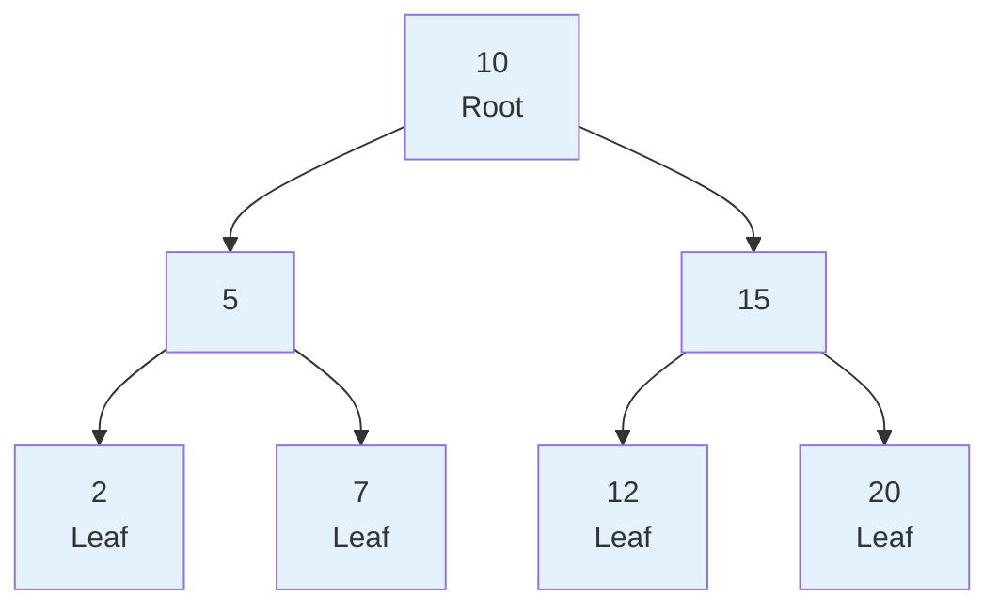
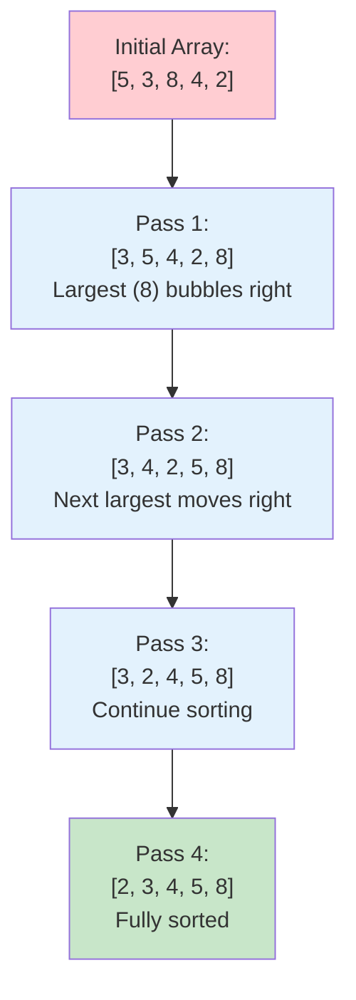

# Lesson 3.5: Data Structures and Algorithms (Part 2)

## Lesson Overview
This lesson continues the exploration of data structures and algorithms in Java. Students will learn about **non-linear data structures**, focusing on **Trees** and **Binary Trees**, which organize data in a hierarchical way rather than sequentially. The lesson also introduces fundamental algorithms such as **Searching**, **Sorting**, and **Recursion**, which form the foundation of efficient problem-solving in programming. By the end of this lesson, learners will understand how data can be represented beyond simple lists and how algorithms process such data efficiently.

**Module:** 3  
**Duration:** 3 hours  
**Prerequisites:** Completion of Lesson 3.4 (Linear Data Structures and Algorithms Part 1)

---

## Lesson Objectives
By the end of this lesson, students will be able to:
- Differentiate between linear and non-linear data structures.
- Describe the structure and characteristics of Trees and Binary Trees.
- Implement Linear Search to locate elements in an array.
- Implement Bubble Sort to arrange array elements in ascending order.
- Explain what recursion is and write a simple recursive method.

---

## Part 1: Introduction to Non-Linear Data Structures

In the previous lesson, we explored **linear data structures** such as arrays, lists, and hash-based collections, where elements are stored **sequentially** — one after another.  
However, not all problems fit neatly into a linear order. Some require **hierarchical** or **network-like** relationships between data elements.

This is where **non-linear data structures** come in.

### What Are Non-Linear Data Structures?

In a **non-linear data structure**, data elements are **not arranged sequentially**. Instead, they are connected in a way that represents relationships like parent–child or node–connection.  
This allows more complex data relationships and efficient solutions to problems like hierarchical representation (organization charts, file systems) or path finding (maps, graphs).

| Feature | Linear Structure | Non-Linear Structure |
|----------|------------------|----------------------|
| Arrangement | Sequential (one after another) | Hierarchical or network-based |
| Traversal | One path (start to end) | Multiple paths possible |
| Example Structures | Array, LinkedList, ArrayList | Tree, Binary Tree, Graph |
| Use Case | Storing ordered data | Representing relationships |



---

## Part 2: Trees

A **Tree** is a non-linear data structure that represents data in a **hierarchical** manner. It is made up of **nodes** connected by **edges**. Each node can have **zero or more child nodes**, forming parent–child relationships.

Think of a tree like a **family tree** or a **folder structure** on your computer:
- The **root** is the starting point (e.g., "C Drive").
- Each **folder** can contain subfolders (children).
- The **leaves** are folders or files that don't have anything inside.

---

### Basic Terms in a Tree

| Term | Description |
|------|--------------|
| **Root Node** | The topmost node in a tree. There is only one root. |
| **Parent Node** | A node that has one or more children. |
| **Child Node** | A node that descends from another node. |
| **Leaf Node** | A node that has no children. |
| **Edge** | The connection between two nodes. |
| **Subtree** | A smaller section of a tree that can be treated as a tree itself. |
| **Level** | The depth or generation of nodes starting from the root. |

---

### Visual Representation

Here's an example of a simple tree representing an organization structure:



- **CEO** → Root node
- **Manager1**, **Manager2** → Child nodes of CEO
- **Dev1**, **Dev2**, **Tester1** → Leaf nodes (no children)

---

### Understanding Trees in Java (Conceptual)

Java does not provide a built-in `Tree` class, but it provides **TreeMap** and **TreeSet** which use internal tree structures (Red-Black Trees) to maintain sorted data.  
At this stage, we focus on **understanding how trees work conceptually**, rather than implementing complex versions.

Let's simulate a simple tree using nested arrays (since classes are not yet taught):

```java
public class SimpleTree {
  public static void main(String[] args) {

    // Representing a simple organizational tree using arrays
    String root = "CEO";
    String[] level1 = {"Manager1", "Manager2"};
    String[] level2_manager1 = {"Dev1", "Dev2"};
    String[] level2_manager2 = {"Tester1"};

    System.out.println("Root Node: " + root);

    System.out.println("\nChildren of " + root + ":");
    for (String manager : level1) {
      System.out.println("  - " + manager);
    }

    System.out.println("\nChildren of Manager1:");
    for (String dev : level2_manager1) {
      System.out.println("  - " + dev);
    }

    System.out.println("\nChildren of Manager2:");
    for (String tester : level2_manager2) {
      System.out.println("  - " + tester);
    }
  }
}
```

**Output:**
```
Root Node: CEO

Children of CEO:
  - Manager1
  - Manager2

Children of Manager1:
  - Dev1
  - Dev2

Children of Manager2:
  - Tester1
```

This simple example demonstrates the hierarchical structure of a tree — each node may have multiple child nodes, and data is not stored sequentially but in parent–child relationships.

### Activity: Build Your Own Tree **(5 minutes)**

Write a Java program to represent a **school structure** using arrays:
- Root node: `"Principal"`
- Children: `"Teacher1"`, `"Teacher2"`
- Each teacher has two students
- Display all nodes in a clear hierarchical format

---

### Key Takeaways
- A **Tree** is a hierarchical, non-linear structure made of nodes and edges.
- It starts with a **root node** and expands into **subtrees**.
- Trees are widely used in real-world applications such as file systems, databases, and organizational hierarchies.
- In Java, conceptual tree structures can be simulated using arrays or later implemented using custom node classes once OOP is covered.

---

## Part 3: Binary Trees

A **Binary Tree** is a special type of tree in which each node can have **at most two children** — a **left child** and a **right child**.  
This restriction makes binary trees simpler to implement and efficient for operations such as searching and sorting.  
Binary Trees are one of the most widely used data structures in computer science. They form the foundation of structures such as **Binary Search Trees**, **Heaps**, and **Syntax Trees** in compilers.

---

### Characteristics of a Binary Tree
- Each node can have **0, 1, or 2 children**.
- The topmost node is called the **root node**.
- Every node connects downward to its children through **left** and **right** links.
- Nodes with no children are called **leaf nodes**.
- Binary trees can grow in depth (levels), where each level doubles the number of potential nodes.

---

### Visual Example

Below is a simple representation of a binary tree that stores numeric values:



- 10 is the root.
- 5 and 15 are the children of 10.
- 2, 7, 12, and 20 are leaf nodes.
- Every node has at most two children.

---

### Representing a Binary Tree in Java (Conceptual)

We will use parallel arrays to represent the parent–child relationships of a binary tree.

```java
public class SimpleBinaryTree {
  public static void main(String[] args) {

    // Representing nodes of a binary tree using arrays
    int[] nodes = {10, 5, 15, 2, 7, 12, 20};
    String[] leftChild = {"5", "2", "12", "null", "null", "null", "null"};
    String[] rightChild = {"15", "7", "20", "null", "null", "null", "null"};

    System.out.println("Binary Tree Nodes and Their Children:\n");

    for (int i = 0; i < nodes.length; i++) {
      System.out.println("Node " + nodes[i] +
                         " -> Left: " + leftChild[i] +
                         ", Right: " + rightChild[i]);
    }
  }
}
```

**Output:**
```
Binary Tree Nodes and Their Children:

Node 10 -> Left: 5, Right: 15
Node 5 -> Left: 2, Right: 7
Node 15 -> Left: 12, Right: 20
Node 2 -> Left: null, Right: null
Node 7 -> Left: null, Right: null
Node 12 -> Left: null, Right: null
Node 20 -> Left: null, Right: null
```

This approach helps visualise how binary tree nodes are connected logically through left and right links. Later, when students learn classes, they can represent each node as an object with left and right references.

---

### Key Takeaways
- A Binary Tree is a hierarchical structure where each node can have at most two children.
- Binary Trees are used as the basis for Binary Search Trees, Heaps, and Expression Trees.
- Understanding binary trees helps in mastering more complex algorithms such as searching and recursion.

---

## Part 4: Algorithms — Searching

An **algorithm** is a step-by-step procedure to solve a problem. In the context of data structures, algorithms are used to perform operations such as searching, sorting, and traversing data efficiently.  
In this section, we focus on **searching algorithms**, which are used to find the position of a specific element within a collection such as an array or a list.

---

### Understanding Algorithm Efficiency

Before we dive into searching algorithms, it's important to understand how we measure their performance.

> **📊 Algorithm Efficiency — Big O Notation:**
>
> When we write **O(n)** or **O(log n)**, we're measuring how the algorithm's speed changes as data grows:
>
> - **O(1)** = **Constant time** — Always the same speed, regardless of data size (e.g., accessing an array element by index)
> - **O(n)** = **Linear time** — Time grows proportionally with data size (e.g., checking every element in a list)
> - **O(log n)** = **Logarithmic time** — Much faster; divides the problem in half repeatedly
> - **O(n²)** = **Quadratic time** — Time grows with the square of data size (e.g., nested loops)
>
> **Example:** If you have 100 items:
> - O(1) takes the same time regardless of size
> - O(n) takes 100 steps
> - O(log n) takes about 7 steps
> - O(n²) takes 10,000 steps
>
> Lower complexity = faster algorithm for large datasets!

---

### What Is Searching?

Searching is the process of checking whether a particular element exists in a collection and, if it does, determining its position or index.

---

### Linear Search

A **Linear Search** (also known as a sequential search) checks each element in a list one by one until the desired element is found or the list ends.  
It is the simplest and most straightforward searching algorithm.

- **Concept:** Start from the first element and compare it with the target value.
- **Best case:** The element is found at the first position.
- **Worst case:** The element is not found, or it is the last one — O(n) complexity.
- **Use case:** Works on both sorted and unsorted lists.

```java
public class LinearSearchDemo {
  public static void main(String[] args) {
    int[] numbers = {4, 8, 15, 16, 23, 42};
    int target = 15;
    boolean found = false;

    for (int i = 0; i < numbers.length; i++) {
      if (numbers[i] == target) {
        System.out.println("Element found at index: " + i);
        found = true;
        break;
      }
    }

    if (!found) {
      System.out.println("Element not found in the array.");
    }
  }
}
```

**Output:**
```
Element found at index: 2
```

---

### Activity: Implement Linear Search **(5 minutes)**

- Create a new file `SearchDemo.java`
- Declare an array of 8 integers: `{2, 5, 8, 12, 16, 23, 38, 45}`
- Use **Linear Search** to find the number `16` — print the index when found
- Try searching for a number that doesn't exist (e.g., `99`) and print `"Not found"`

---

### Key Takeaways
- Searching algorithms help locate elements in a collection efficiently.
- **Linear Search** checks each element one by one and works on any dataset — sorted or unsorted.
- It is simple to implement and perfectly sufficient for small datasets.

---

## Part 5: Algorithms — Sorting

Sorting is the process of arranging data in a particular order — typically ascending or descending.  
Efficient sorting improves the performance of other operations such as searching and data retrieval.

---

### What Is Sorting?

Sorting algorithms organise the elements of a list so they can be processed or searched efficiently.

- **Ascending Order:** From smallest to largest (e.g., 1, 3, 5, 7)
- **Descending Order:** From largest to smallest (e.g., 7, 5, 3, 1)
- **Goal:** Reduce the time it takes to find or compare elements
- **Key Idea:** Compare elements and swap them into the correct position

---

### Bubble Sort

Bubble Sort is the simplest sorting algorithm. It repeatedly compares adjacent elements and swaps them if they are in the wrong order.  
After each pass, the largest element "bubbles up" to the end of the list.

- **Concept:** Repeatedly compare adjacent pairs and swap if needed.
- **Time Complexity:** O(n²) — because of nested loops.
- **Best Case:** When the list is already sorted.
- **Worst Case:** When the list is completely unsorted.
- **Use Case:** Educational use and small data sets.

```java
public class BubbleSortDemo {
  public static void main(String[] args) {
    int[] numbers = {5, 3, 8, 4, 2};
    int n = numbers.length;

    for (int i = 0; i < n - 1; i++) {
      for (int j = 0; j < n - i - 1; j++) {
        if (numbers[j] > numbers[j + 1]) {
          int temp = numbers[j];
          numbers[j] = numbers[j + 1];
          numbers[j + 1] = temp;
        }
      }
    }

    System.out.print("Sorted array: ");
    for (int num : numbers) {
      System.out.print(num + " ");
    }
  }
}
```

**Output:**
```
Sorted array: 2 3 4 5 8
```



---

### Other Sorting Algorithms (Awareness Only — No Coding Required)

You don't need to implement these today, but it's good to know they exist. These algorithms are faster for large datasets and use more advanced techniques internally:

- **Selection Sort:** Finds the smallest element and moves it to the correct position each pass.
- **Insertion Sort:** Builds the sorted list one element at a time. Efficient for small or nearly sorted datasets.
- **Merge Sort:** Uses divide-and-conquer to split the array and merge in sorted order.
- **Quick Sort:** Selects a pivot element to partition the array. Very efficient on large datasets.

| Algorithm | Time Complexity | Best For |
|------------|-----------------|----------|
| **Bubble Sort** | O(n²) | Learning and small data |
| **Selection Sort** | O(n²) | Fewer swaps needed |
| **Insertion Sort** | O(n²) | Small or partially sorted data |
| **Merge Sort** | O(n log n) | Large datasets |
| **Quick Sort** | O(n log n) average | General-purpose fast sorting |

---

### Activity: Implement Bubble Sort **(5 minutes)**

- Create a new file `SortDemo.java`
- Declare this array: `{45, 12, 89, 33, 67}`
- Sort it using **Bubble Sort** and print the result
- Expected output: `12 33 45 67 89`

---

### Key Takeaways
- Sorting organises data to make searching and comparison faster.
- **Bubble Sort** repeatedly swaps adjacent elements until the list is sorted.
- Nested loops give Bubble Sort an O(n²) time complexity.
- Faster algorithms like Merge Sort and Quick Sort exist for larger datasets.

---

## Part 6: Recursion

**Recursion** is a programming technique where a function calls itself to solve a problem by breaking it down into smaller, simpler versions of the same problem.  
Recursion is a fundamental concept in computer science and is particularly powerful when working with hierarchical data structures like trees.

---

### What Is Recursion?

Recursion occurs when a function invokes itself during its execution. Each recursive call works on a smaller portion of the problem until it reaches a **base case** — a condition where the function stops calling itself and returns a result.

Think of recursion like a set of **Russian nesting dolls**:
- You open one doll (solve one part of the problem)
- Inside is another smaller doll (a simpler version of the same problem)
- You keep opening dolls until you reach the smallest one that doesn't open (the base case)

---

### Key Components of Recursion

Every recursive function must have two essential components:

| Component | Description |
|-----------|-------------|
| **Base Case** | The stopping condition that prevents infinite recursion. When reached, the function returns a value without making another recursive call. |
| **Recursive Case** | The part where the function calls itself with a simpler or smaller input, moving toward the base case. |

Without a base case, the function would call itself forever, causing a **stack overflow error**.

---

### Simple Example: Factorial

The factorial of a number `n` (written as `n!`) is the product of all positive integers from 1 to n.

**Mathematical Definition:**
- 5! = 5 × 4 × 3 × 2 × 1 = 120
- 3! = 3 × 2 × 1 = 6
- 1! = 1
- 0! = 1 (by definition)

**Recursive Definition:**
- factorial(n) = n × factorial(n - 1)
- factorial(0) = 1 (base case)

```java
public class RecursionDemo {

  // Recursive method to calculate factorial
  public static int factorial(int n) {
    // Base case: stop recursion when n is 0 or 1
    if (n == 0 || n == 1) {
      return 1;
    }

    // Recursive case: n! = n × (n-1)!
    return n * factorial(n - 1);
  }

  public static void main(String[] args) {
    int number = 5;
    int result = factorial(number);
    System.out.println("Factorial of " + number + " is: " + result);
  }
}
```

**Output:**
```
Factorial of 5 is: 120
```

**How It Works:**
```
factorial(5)
  = 5 × factorial(4)
  = 5 × (4 × factorial(3))
  = 5 × (4 × (3 × factorial(2)))
  = 5 × (4 × (3 × (2 × factorial(1))))
  = 5 × (4 × (3 × (2 × 1)))
  = 5 × 24
  = 120
```

---

### Another Example: Sum of Numbers

Calculate the sum of all numbers from 1 to n.

```java
public class SumRecursion {

  public static int sum(int n) {
    // Base case
    if (n == 1) {
      return 1;
    }

    // Recursive case
    return n + sum(n - 1);
  }

  public static void main(String[] args) {
    int number = 5;
    System.out.println("Sum of 1 to " + number + " is: " + sum(number));
  }
}
```

**Output:**
```
Sum of 1 to 5 is: 15
```

---

### Recursion vs. Iteration

Many problems can be solved using either recursion or iteration (loops). Here's a comparison:

| Aspect | Recursion | Iteration |
|--------|-----------|-----------|
| **Readability** | Often clearer for hierarchical problems | Simpler for counting and loops |
| **Memory** | Uses call stack (more memory) | Uses less memory |
| **Best For** | Trees, divide-and-conquer | Sequential operations |

**Example — Same Problem, Two Approaches:**

```java
// Recursive approach
public static int factorialRecursive(int n) {
  if (n <= 1) return 1;
  return n * factorialRecursive(n - 1);
}

// Iterative approach
public static int factorialIterative(int n) {
  int result = 1;
  for (int i = 2; i <= n; i++) {
    result *= i;
  }
  return result;
}
```

Both produce the same result — recursion is more elegant for this type of problem.

---

### Activity: Practice Recursion **(5 minutes)**

**Countdown:** Write a method `countdown(int n)` that prints numbers from `n` down to `1`, then prints `"Go!"`.

- Base case: if `n == 0`, print `"Go!"` and return
- Recursive case: print `n`, then call `countdown(n - 1)`
- Test with `countdown(5)` — expected output: `5 4 3 2 1 Go!`

> 🔵 **Bonus:** Write a method `power(int x, int n)` that calculates `x` raised to the power of `n`.
> - Base case: `power(x, 0) = 1`
> - Recursive case: `power(x, n) = x × power(x, n-1)`
> - Test with `power(2, 5)` — expected output: `32`

---

### Key Takeaways
- **Recursion** is when a function calls itself to solve smaller instances of the same problem.
- Every recursive function must have a **base case** to stop and a **recursive case** to break the problem down.
- Without a base case, you get a **stack overflow error**.
- Recursion is particularly useful for hierarchical structures like trees.
- For simple problems, iteration with a loop is often easier — recursion shines when problems are naturally hierarchical.

---

## Lesson Summary

In this lesson, we explored:

1. **Non-Linear Data Structures** — Data organised hierarchically rather than sequentially
2. **Trees** — Hierarchical structures with parent-child relationships
3. **Binary Trees** — Trees where each node has at most two children
4. **Linear Search** — Simple sequential search that works on any dataset — O(n)
5. **Bubble Sort** — Simple sorting by repeatedly swapping adjacent elements — O(n²)
6. **Recursion** — Functions that call themselves to solve problems incrementally

These concepts form the foundation for more advanced topics in data structures and algorithms, including Binary Search Trees, Heaps, Graph algorithms, and dynamic programming.

---

## 🔵 Optional: Selection Sort

> For students who finish early or want to explore further. Try this after completing all core activities.

**Selection Sort** improves on Bubble Sort by reducing the number of swaps. Instead of comparing adjacent pairs repeatedly, it scans for the smallest element in the unsorted portion and moves it to the front in a single swap per pass.

- **Concept:** Select the smallest element and move it to its correct position.
- **Time Complexity:** O(n²) — still uses nested loops.
- **Use Case:** When minimising data movement (swaps) is important.

```java
public class SelectionSortDemo {
  public static void main(String[] args) {
    int[] numbers = {64, 25, 12, 22, 11};
    int n = numbers.length;

    for (int i = 0; i < n - 1; i++) {
      int minIndex = i;
      for (int j = i + 1; j < n; j++) {
        if (numbers[j] < numbers[minIndex]) {
          minIndex = j;
        }
      }

      int temp = numbers[minIndex];
      numbers[minIndex] = numbers[i];
      numbers[i] = temp;
    }

    System.out.print("Sorted array: ");
    for (int num : numbers) {
      System.out.print(num + " ");
    }
  }
}
```

**Output:**
```
Sorted array: 11 12 22 25 64
```

Try running this on the same array from the Bubble Sort activity — `{45, 12, 89, 33, 67}` — and confirm both algorithms produce the same sorted result.
