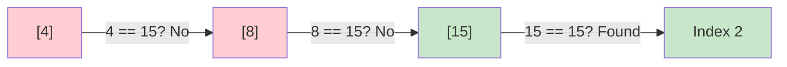
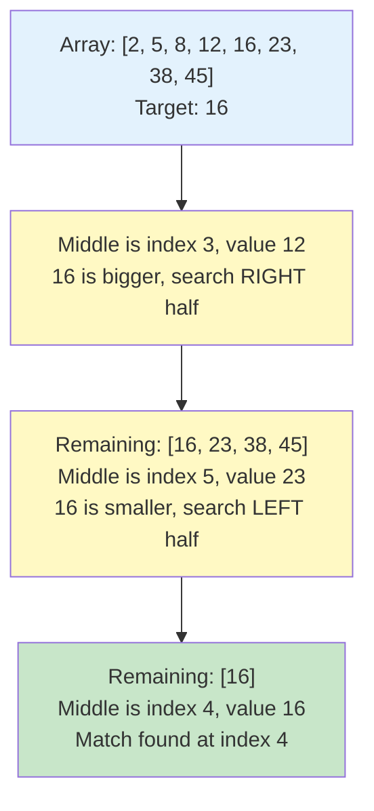
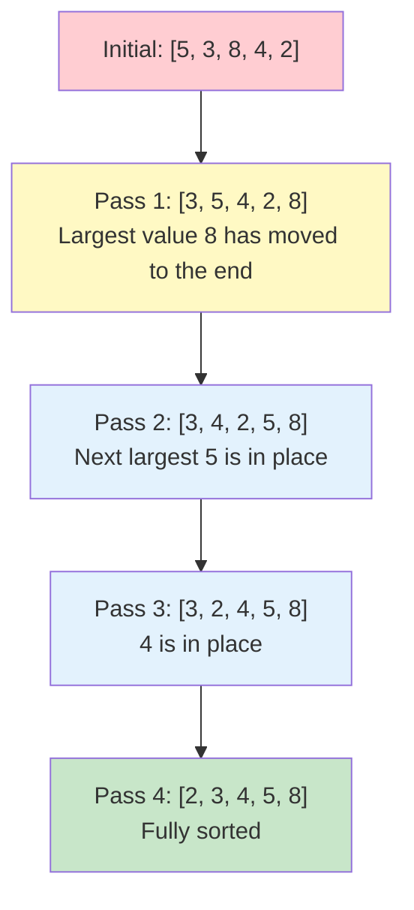
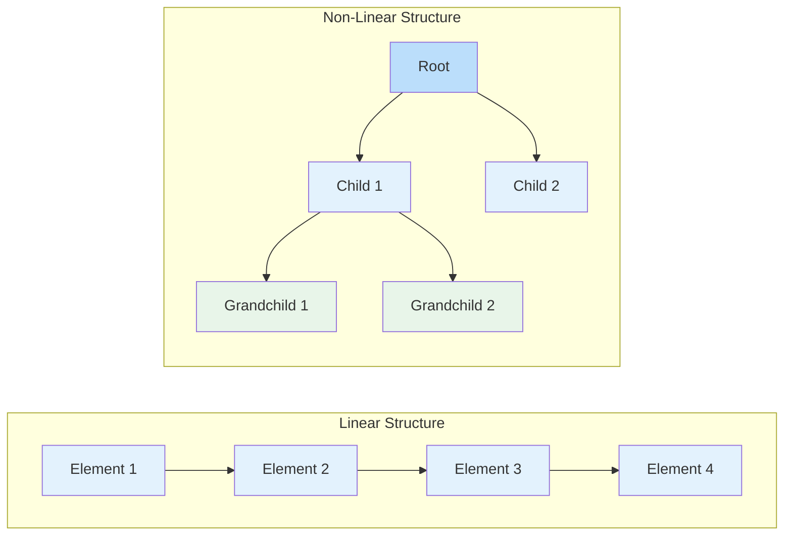
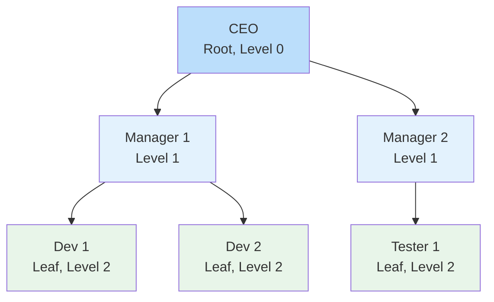
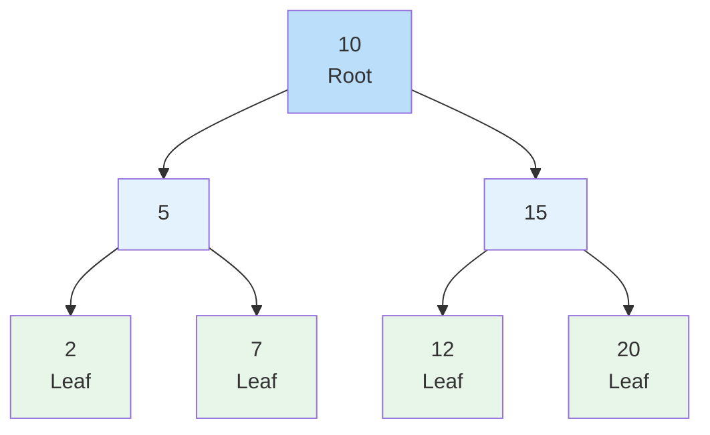
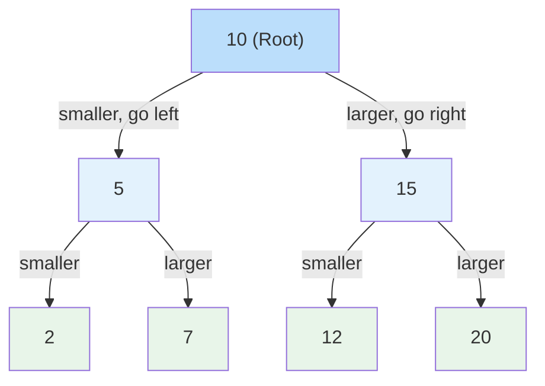

# Lesson 3.5: Data Structures and Algorithms (Part 2)

## Lesson Overview
This lesson continues from Lesson 3.4. Having learned how to **store** data, we now look at how to **process** it — how to search through it, how to sort it, and how to represent data that does not fit into a simple list. Students will implement Linear Search, Binary Search, and Bubble Sort, then explore **non-linear data structures** — Trees, Binary Trees, and Binary Search Trees — and discover how these underpin the sorted collections they already used in Lesson 3.4.

**Module:** 3.5
**Duration:** 3 hours
**Prerequisites:** Completion of Lesson 3.4 (Data Structures and Algorithms Part 1)

---

## Lesson Objectives
By the end of this lesson, students will be able to:
- Implement Linear Search to locate elements in an array.
- Implement Binary Search and explain why it requires sorted data.
- Compare the two search approaches and choose appropriately.
- Implement Bubble Sort and explain why sorting is expensive.
- Describe what Java's built-in sorting methods actually use.
- Describe the structure of Trees, Binary Trees, and Binary Search Trees.
- Explain how a Binary Search Tree powers TreeMap and TreeSet.

---

## Connecting Back to Lesson 3.4

In Lesson 3.4 we covered how to **store and organise data**. In this lesson we focus on **what you do with it** — finding it, sorting it, and representing relationships that a flat list cannot express.

| From 3.4 | What We Do With It in 3.5 |
|----------|--------------------------|
| Array | Linear Search, Binary Search, Bubble Sort |
| ArrayList | Linear Search, `Collections.sort()` revisited |
| ArrayDeque | Used internally by many tree and graph algorithms |
| HashMap / HashSet | Already fast lookup by key — no search algorithm needed |
| TreeMap / TreeSet | Built on a Binary Search Tree — explained fully in this lesson |
| `Comparator` | The rule that decides sort order |
| `record` | Still your default for objects held in Sets and Maps |

> **Note:** In Lesson 3.4 you called `Collections.sort()` and it just worked. In this lesson you will see what is happening underneath, and why Java's version is far better than anything you would write by hand.

---

## Part 1: Searching

An **algorithm** is a step-by-step procedure for solving a problem. We start with the most common problem of all — finding something.

---

### Linear Search

A **Linear Search** checks each element one by one until it finds the target or runs out of elements.

- Works on **any** data, sorted or not
- Best case: the element is first — one check
- Worst case: the element is last or missing — every element is checked

```java
public class LinearSearchDemo {
  public static void main(String[] args) {
    int[] numbers = {4, 8, 15, 16, 23, 42};
    int target = 15;
    boolean found = false;

    for (int i = 0; i < numbers.length; i++) {
      if (numbers[i] == target) {
        System.out.println("Element found at index: " + i);
        found = true;
        break;
      }
    }

    if (!found) {
      System.out.println("Element not found in the array.");
    }
  }
}
```

**Output:**
```
Element found at index: 2
```



The `break` matters here. Without it, the loop keeps running after the element is found, doing work for no reason.

---

### Binary Search

**Binary Search** is far faster, but it comes with one strict condition: **the data must already be sorted.**

Instead of checking every element, it looks at the middle, then throws away half the remaining data — and repeats.

**How it works:**
1. Look at the middle element
2. If it matches the target, you are done
3. If the target is smaller, search the left half
4. If the target is larger, search the right half
5. Repeat until found, or nothing is left to search

```java
public class BinarySearchDemo {
  public static void main(String[] args) {
    int[] numbers = {2, 5, 8, 12, 16, 23, 38, 45}; // must be sorted
    int target = 16;

    int left = 0;
    int right = numbers.length - 1;
    boolean found = false;

    while (left <= right) {
      int middle = (left + right) / 2;

      if (numbers[middle] == target) {
        System.out.println("Element found at index: " + middle);
        found = true;
        break;
      } else if (numbers[middle] < target) {
        left = middle + 1;   // search the right half
      } else {
        right = middle - 1;  // search the left half
      }
    }

    if (!found) {
      System.out.println("Element not found.");
    }
  }
}
```

**Output:**
```
Element found at index: 4
```



---

### Why Binary Search Wins

Forget the theory for a moment and just count the steps.

| Number of records | Linear Search, worst case | Binary Search, worst case |
|-------------------|--------------------------|--------------------------|
| 100 | up to 100 checks | 7 checks |
| 1,000 | up to 1,000 checks | 10 checks |
| 1,000,000 | up to 1,000,000 checks | 20 checks |
| 1,000,000,000 | up to 1,000,000,000 checks | 30 checks |

Every single check in Binary Search removes half of what is left. That is why the numbers stay so small. A billion records takes 30 checks.

This is the payoff for keeping data sorted. Sorting has a cost, but if you search that data repeatedly, you get it back many times over.

> **Important:** Binary Search on unsorted data does not throw an error. It simply returns the wrong answer, silently. Always confirm your data is sorted first.

---

### 👨‍💻 Activity 1: Compare Both Search Approaches **(15 minutes)**

Use this sorted array: `{3, 7, 11, 19, 24, 35, 48, 56, 72, 90}`

1. Implement **Linear Search** to find `35`. Print the index and count how many checks it took.
2. Implement **Binary Search** to find `35`. Print the index and count how many checks it took.
3. Compare the two counts.
4. Now search for `100`, which is not in the array, using both. What does each one do?

**Hint:** add a counter variable that increments once per loop iteration.

---

## Part 2: Sorting

Sorting arranges data into order. It matters because so many other operations — Binary Search included — depend on ordered data.

---

### Bubble Sort

Bubble Sort is the simplest sorting algorithm to understand. It compares each pair of neighbouring elements and swaps them if they are the wrong way round. After each full pass, the largest remaining value has moved to its correct position at the end.

```java
public class BubbleSortDemo {
  public static void main(String[] args) {
    int[] numbers = {5, 3, 8, 4, 2};
    int n = numbers.length;

    for (int i = 0; i < n - 1; i++) {
      for (int j = 0; j < n - i - 1; j++) {
        if (numbers[j] > numbers[j + 1]) {
          int temp = numbers[j];
          numbers[j] = numbers[j + 1];
          numbers[j + 1] = temp;
        }
      }
    }

    System.out.print("Sorted array: ");
    for (int num : numbers) {
      System.out.print(num + " ");
    }
  }
}
```

**Output:**
```
Sorted array: 2 3 4 5 8
```



### Why Sorting Is Expensive

Notice the **nested loop** — a loop inside a loop. That is what makes sorting costly. Count the comparisons:

| Number of items | Roughly how many comparisons |
|-----------------|------------------------------|
| 5 | about 25 |
| 100 | about 10,000 |
| 1,000 | about 1,000,000 |

The work grows much faster than the data does. Doubling your data roughly quadruples the work. This is why nobody uses Bubble Sort on real datasets — and why understanding it helps you appreciate what Java gives you instead.

---

### 👨‍💻 Activity 2: Implement Bubble Sort **(10 minutes)**

1. Create a file `SortDemo.java`
2. Declare this array: `{45, 12, 89, 33, 67}`
3. Sort it using Bubble Sort and print the result
4. Expected output: `12 33 45 67 89`
5. **Bonus:** run your Binary Search from Activity 1 on the sorted result to find `45`

---

### What Java Actually Uses

In Lesson 3.4 you sorted a list like this:

```java
Collections.sort(products);
products.sort(Comparator.comparing(Product::price));
```

One line, and it worked. So what is running underneath?

Java does not use Bubble Sort. It uses two different, highly optimised algorithms depending on what you are sorting:

**For primitives — `int[]`, `double[]`, `char[]` — Java uses Dual-Pivot Quicksort.**

Standard Quicksort picks one value as a pivot and splits the data into "smaller than" and "larger than" groups, then repeats on each group. Java's version picks **two** pivots and splits into three groups instead of two. Fewer passes, fewer comparisons, better use of the processor cache. It was contributed to the JDK in 2009 and measurably outperformed the previous implementation.

**For objects — `List<Product>`, `String[]` — Java uses TimSort.**

TimSort is built on a practical observation: real-world data is rarely random. It usually contains stretches that are already in order. TimSort finds those stretches, called runs, and merges them intelligently instead of sorting from scratch.

On data that is already sorted, TimSort finishes in a single pass. It was designed for Python in 2002 and adopted by Java in Java 7.

**Why two algorithms?**

Because they optimise for different things. Sorting objects must be **stable** — if two products have the same price, they must stay in their original relative order after sorting. TimSort guarantees this. Quicksort does not, but for primitives it does not matter: one `5` is indistinguishable from another `5`, so stability is meaningless.

**The practical takeaway:** always use `Arrays.sort()` or `Collections.sort()`. They are the result of decades of tuning by people who do nothing else. Understanding Bubble Sort tells you *why* sorting costs something — it does not mean you should ever write your own.

---

## Part 3: Non-Linear Data Structures

In Lesson 3.4 we covered two of the three categories of data structure. Here is the full picture:

| Category | Structures | How data is stored |
|----------|-----------|-------------------|
| **Linear** | Array, ArrayList, LinkedList, ArrayDeque | Sequentially, one after another |
| **Hash-Based** | HashMap, HashSet and variants | By hash code, no sequence |
| **Non-Linear** | Tree, Binary Tree | Hierarchically, as parent and child |

In a **non-linear structure**, elements are not arranged in a sequence. They are connected to express relationships — most commonly a parent-and-child hierarchy. This suits data that a flat list cannot represent naturally: an organisation chart, a folder structure, a category hierarchy in an online store.

| | Linear Structure | Non-Linear Structure |
|--|------------------|----------------------|
| Arrangement | One after another | Hierarchical |
| Traversal | A single path, start to end | Several possible paths |
| Examples | Array, ArrayList, LinkedList | Tree, Binary Tree |
| Suits | Ordered data | Relationships between data |



---

## Part 4: Trees

A **Tree** organises data hierarchically. It is made of **nodes** connected by **edges**, where each node may have any number of children.

The everyday comparison is a folder structure. There is one starting point, folders contain other folders, and eventually you reach files with nothing inside them.

### Terms You Need

| Term | Meaning |
|------|---------|
| **Root** | The single node at the top |
| **Parent** | A node with one or more children |
| **Child** | A node beneath a parent |
| **Leaf** | A node with no children |
| **Edge** | The link between two nodes |
| **Subtree** | Any node together with everything beneath it |
| **Level** | How far down a node sits, counting the root as level 0 |



### Trees in Java

Unlike ArrayList or HashMap, **Java has no built-in `Tree` class**. There is nothing to import.

This is deliberate. Trees come in many forms — Binary Tree, Binary Search Tree, AVL Tree, Red-Black Tree — each with different rules. Java provides no general Tree because there is no single sensible default.

What Java does provide is **TreeMap** and **TreeSet**, which use a tree internally to keep data sorted. You never see or touch the tree — you just get sorted data.

> If you genuinely need a tree in a project, you build it yourself with classes, where each node object holds references to its children.

---

## Part 5: Binary Trees

A **Binary Tree** is a tree with one restriction: each node may have **at most two children**, referred to as the left child and the right child.

That single restriction makes the structure predictable, which makes it far easier to write efficient algorithms against.



- 10 is the root
- 5 and 15 are its left and right children
- 2, 7, 12 and 20 are leaves, with no children

> **Look closely:** in this example every left value is smaller than its parent and every right value is larger. That is not a rule of Binary Trees in general — it is the rule of a **Binary Search Tree**, which is next.

---

## Part 6: Binary Search Tree

A **Binary Search Tree**, or BST, is a Binary Tree with one extra rule:

> **Left child is smaller than the parent. Right child is larger than the parent.**

This holds at every node in the tree. It is a small rule with a large consequence.



**Searching for 7:**
1. Start at the root, 10. 7 is smaller, so go left.
2. Now at 5. 7 is larger, so go right.
3. Now at 7. Found it.

Three steps in a tree of seven values. And notice what happened at each step: **half the remaining tree was discarded.**

That should feel familiar. It is exactly what Binary Search did to a sorted array — except here, the structure itself enforces the ordering, so no sorting step is needed.

### Binary Tree vs Binary Search Tree

| | Binary Tree | Binary Search Tree |
|--|-------------|-------------------|
| Children | At most 2 | At most 2 |
| Rule on values | None | Left is smaller, right is larger |
| Searching | Must check every node | Half the tree removed at each step |
| Used for | General hierarchical data | Fast searching and sorted data |

---

### This Is How TreeMap and TreeSet Work

Now the connection back to Lesson 3.4.

```java
TreeMap<String, Integer> scores = new TreeMap<>();
scores.put("Charlie", 78);
scores.put("Alice", 85);
scores.put("Bob", 92);

System.out.println(scores);
// {Alice=85, Bob=92, Charlie=78} — sorted, without you doing anything
```

When you call `scores.get("Bob")`, Java is walking a Binary Search Tree internally. It compares "Bob" against the value at each node and goes left or right accordingly, discarding half the remaining entries at every step.

The same applies to `TreeSet`. And it explains behaviour you already saw in 3.4:

- **Why TreeMap is always sorted** — the tree structure maintains order as you insert
- **Why `firstKey()` and `lastKey()` exist** — they are simply the leftmost and rightmost nodes
- **Why TreeMap is slightly slower than HashMap** — HashMap jumps straight to a location, while TreeMap walks down through several nodes

> **A detail worth knowing:** Java uses a **Red-Black Tree**, which is a Binary Search Tree that rebalances itself. Without rebalancing, inserting already-sorted data would produce a tree that is effectively a straight line, losing all the benefit. The Red-Black rules prevent that. You never see any of this — you just get reliable performance.

---

### 👨‍💻 Activity 3: Build a Binary Search Tree **(10 minutes)**

No code for this one — pen and paper, or a whiteboard.

Insert these values into an empty Binary Search Tree, **in this order**:

`50, 30, 70, 20, 40, 60, 80`

**Rules:** the first value becomes the root. For every value after that, start at the root and go left if the value is smaller, right if it is larger, until you reach an empty spot.

1. Draw the resulting tree.
2. Identify the root, the leaves, and the level of each node.
3. Trace the path to find `40`. How many comparisons did it take?
4. Trace the path to find `65`. What happens, and how do you know it is not in the tree?
5. **Discussion:** now insert `10, 20, 30, 40, 50` into a fresh tree, in that order. What shape do you get, and why is that a problem?

---

## Lesson Summary

| Concept | What It Is | Key Point |
|---------|-----------|-----------|
| Linear Search | Check each element in turn | Works on any data |
| Binary Search | Discard half the data at each step | Requires sorted data |
| Bubble Sort | Repeatedly swap neighbouring elements | Teaching tool only, never production |
| Java's real sorting | Dual-Pivot Quicksort and TimSort | Always use the built-in methods |
| Tree | Hierarchical structure of nodes | No built-in Java class |
| Binary Tree | Each node has at most two children | Foundation for BST |
| Binary Search Tree | Left is smaller, right is larger | Powers TreeMap and TreeSet |

---

## Putting It Together

| What you need to do | Best choice | Why |
|--------------------|-------------|-----|
| Find something by key | HashMap | Direct lookup, no searching involved |
| Search unsorted data | Linear Search | No alternative without sorting first |
| Search sorted data repeatedly | Binary Search | Very few checks, even on huge datasets |
| Keep data permanently sorted | TreeMap or TreeSet | A BST maintains order for you |
| Sort a list once | `Collections.sort()` | TimSort, already optimised |
| Sort an array of numbers | `Arrays.sort()` | Dual-Pivot Quicksort |
| Represent a hierarchy | Build it yourself with classes | Java provides no general Tree |

---

### Key Takeaways
- Linear Search works anywhere. Binary Search is dramatically faster but demands sorted data.
- Binary Search on unsorted data fails silently — it returns a wrong answer rather than an error.
- Sorting is expensive because of nested comparisons, which is why you should never hand-write it.
- Java uses Dual-Pivot Quicksort for primitives and TimSort for objects. Both are far better than anything written by hand.
- Trees represent hierarchy. Java has no general Tree class, so you build your own if you need one.
- A Binary Search Tree discards half the tree at every step, which is what makes TreeMap and TreeSet efficient.
- TreeMap and TreeSet were doing this for you throughout Lesson 3.4.

---

**End of Lesson 3.5**