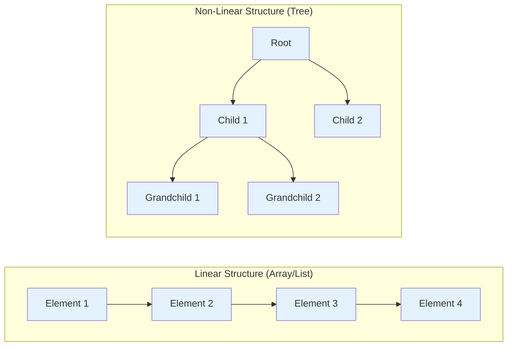
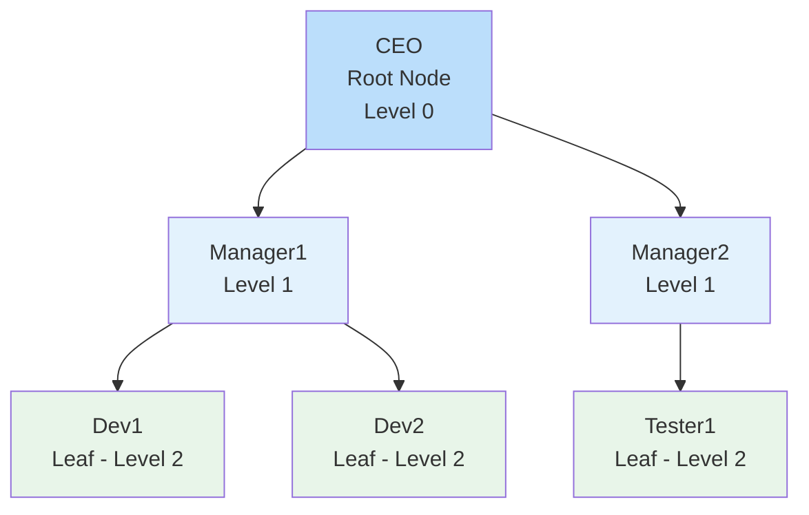
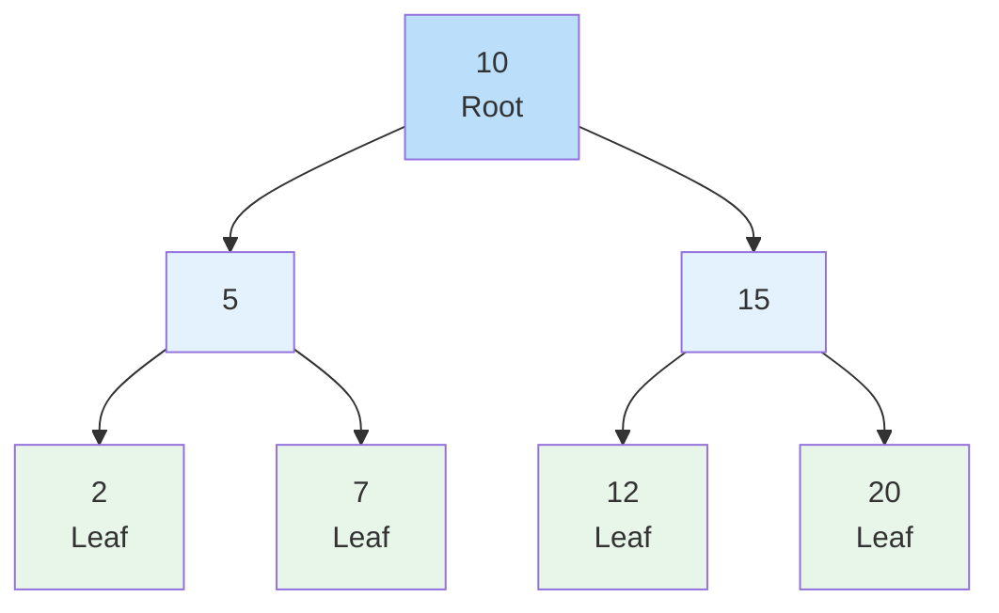
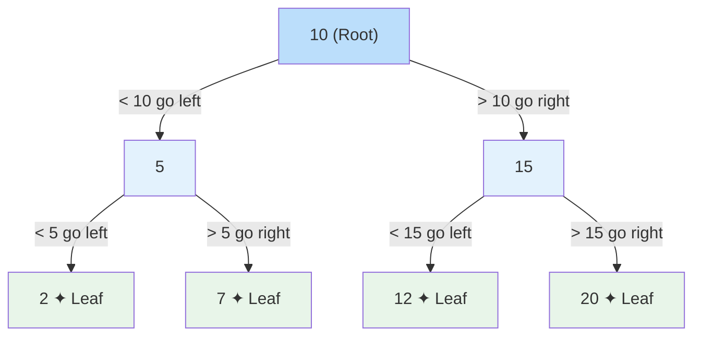
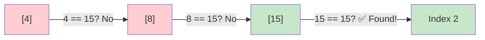
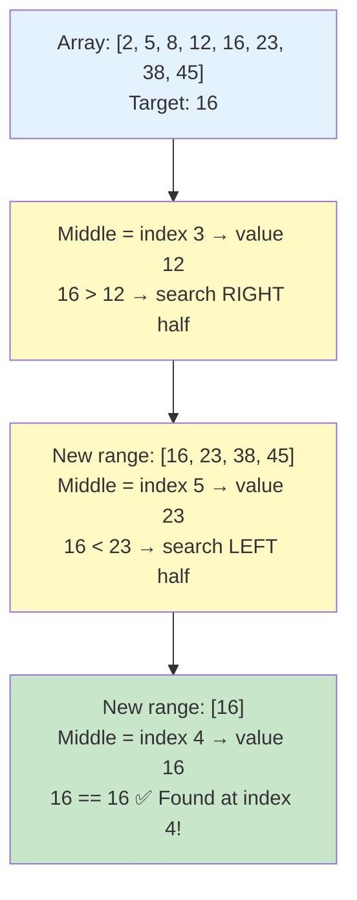
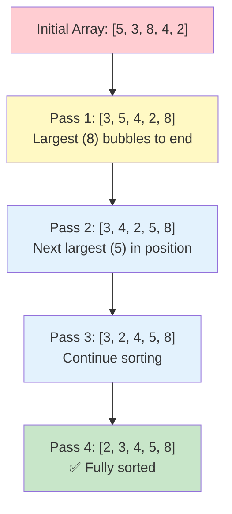

# Lesson 3.5: Data Structures and Algorithms (Part 2)

## Lesson Overview
This lesson continues the exploration of data structures and algorithms in Java. Students will learn about **non-linear data structures**, focusing on **Trees**, **Binary Trees**, and **Binary Search Trees**, which organise data in a hierarchical way rather than sequentially. The lesson also introduces fundamental algorithms — **Linear Search**, **Binary Search**, and **Bubble Sort** — which form the foundation of efficient problem-solving in programming. By the end of this lesson, learners will understand how data can be represented beyond simple lists and how algorithms process such data efficiently.

**Module:** 3.5
**Duration:** 3 hours
**Prerequisites:** Completion of Lesson 3.4 (Linear Data Structures and Algorithms Part 1)

---

## Lesson Objectives
By the end of this lesson, students will be able to:
- Differentiate between linear, hash-based, and non-linear data structures.
- Describe the structure and characteristics of Trees, Binary Trees, and Binary Search Trees.
- Implement Linear Search to locate elements in an array.
- Implement Binary Search and explain why it requires sorted data.
- Compare Linear Search and Binary Search using Big O notation.
- Implement Bubble Sort to arrange array elements in ascending order.

---

## Connecting Back to Lesson 3.4

In Lesson 3.4 we covered how to **store and organise data** using linear and hash-based structures. Now in Part 2 we focus on **processing that data** — how do you find it, how do you sort it, and how do you represent complex relationships that go beyond simple lists.

| From 3.4 | What We Do With It in 3.5 |
|----------|--------------------------|
| Array | Linear Search, Binary Search, Bubble Sort |
| ArrayList | Linear Search |
| HashMap | Already O(1) lookup — no search algorithm needed |
| TreeMap / TreeSet | Uses Binary Search Tree internally — connects to BST concept |

---

## Part 1: Introduction to Non-Linear Data Structures

In the previous lesson, we explored **linear data structures** such as Arrays, ArrayList, and LinkedList, where elements are stored **sequentially** — one after another. However, not all problems fit neatly into a linear order. Some require **hierarchical** or **network-like** relationships between data elements.

This is where **non-linear data structures** come in.

---

### The Three Categories of Data Structures

It is important to understand that data structures fall into **three categories** — not two:

| Category | Structures | How Data is Stored |
|----------|-----------|-------------------|
| **Linear** | Array, ArrayList, LinkedList | Sequentially, one after another |
| **Hash-Based** | HashMap, HashSet and variants | By hash code — no sequence, no hierarchy |
| **Non-Linear** | Tree, Binary Tree, Graph | Hierarchically or as a network |

Hash-based structures are neither linear nor non-linear — they are their own category. Elements are stored based on their **hash code**, which is why HashMap and HashSet have no guaranteed order.

---

### What Are Non-Linear Data Structures?

In a **non-linear data structure**, data elements are **not arranged sequentially**. Instead, they are connected in a way that represents relationships like parent–child or node–connection. This allows more complex data relationships and efficient solutions to problems like hierarchical representation (organisation charts, file systems) or path finding (maps, graphs).

| Feature | Linear Structure | Non-Linear Structure |
|----------|------------------|----------------------|
| Arrangement | Sequential (one after another) | Hierarchical or network-based |
| Traversal | One path (start to end) | Multiple paths possible |
| Example Structures | Array, LinkedList, ArrayList | Tree, Binary Tree, Graph |
| Use Case | Storing ordered data | Representing relationships |



---

## Part 2: Trees

A **Tree** is a non-linear data structure that represents data in a **hierarchical** manner. It is made up of **nodes** connected by **edges**. Each node can have **zero or more child nodes**, forming parent–child relationships.

Think of a tree like a **folder structure** on your computer:
- The **root** is the starting point (e.g., "C Drive").
- Each **folder** can contain subfolders (children).
- The **leaves** are files or empty folders with nothing inside.

---

### Basic Terms in a Tree

| Term | Description |
|------|--------------|
| **Root Node** | The topmost node in a tree. There is only one root. |
| **Parent Node** | A node that has one or more children. |
| **Child Node** | A node that descends from another node. |
| **Leaf Node** | A node that has no children. |
| **Edge** | The connection between two nodes. |
| **Subtree** | A smaller section of a tree that can be treated as a tree itself. |
| **Level** | The depth or generation of nodes starting from the root. |

---

### Visual Representation



- **CEO** → Root node (Level 0)
- **Manager1, Manager2** → Child nodes of CEO (Level 1)
- **Dev1, Dev2, Tester1** → Leaf nodes — no children (Level 2)

---

### Trees in Java

Unlike HashMap, HashSet, ArrayList and other structures from Lesson 3.4, **Java does not provide a built-in Tree class** in the Collections Framework. There is no `Tree` you can simply import and use.

Java does provide **TreeMap** and **TreeSet** — but these use a tree structure internally to keep data sorted. As a developer you never interact with the tree structure underneath — you just use them as a sorted Map or Set.

If you need a true tree structure in a real project, you build it yourself using classes and OOP — where each node becomes an object with references to its children.

> 💡 **Key Takeaway:** Java gives you tree-powered tools (TreeMap, TreeSet) but not a raw tree to work with directly. Understanding the concept is what matters here.

---

### Key Takeaways
- A **Tree** is a hierarchical, non-linear structure made of nodes and edges.
- Trees are widely used in file systems, databases, and organisational hierarchies.
- Java has no built-in Tree class — TreeMap and TreeSet use trees internally but don't expose the structure directly.

---

## Part 3: Binary Trees

A **Binary Tree** is a special type of tree in which each node can have **at most two children** — a **left child** and a **right child**. This restriction makes binary trees simpler to implement and efficient for operations such as searching and sorting.

---

### Characteristics of a Binary Tree
- Each node can have **0, 1, or 2 children** maximum.
- The topmost node is called the **root node**.
- Every node connects downward through **left** and **right** links.
- Nodes with no children are called **leaf nodes**.
- Each level of the tree can hold double the nodes of the level above.

---

### Visual Example



- 10 is the root.
- 5 and 15 are the left and right children of 10.
- 2, 7, 12, and 20 are leaf nodes.
- Every node has **at most two children**.

> 💡 **Notice:** This Binary Tree also happens to follow a pattern — left values are smaller than the parent, right values are larger. This is not a rule of Binary Trees in general, but it is the rule of a special type called a **Binary Search Tree**, covered next.

---

### Binary Trees in Java

Just like general Trees, **Java has no built-in Binary Tree class**. The Collections Framework does not include one because trees have too many variations — Binary Tree, Binary Search Tree, AVL Tree, Red-Black Tree — each with different rules. Java left it to developers to build their own using OOP.

> 💡 **Real World Connection:** When you use `TreeMap` or `TreeSet`, a **Red-Black Tree** (a self-balancing Binary Tree) is working behind the scenes — giving you sorted data at O(log n) performance without building it yourself.

---

### Key Takeaways
- A Binary Tree allows each node to have **at most two children** — left and right.
- Java has no built-in Binary Tree — developers implement their own using OOP when needed.
- TreeMap and TreeSet are powered by Binary Trees internally.

---

## Part 4: Binary Search Tree (BST)

A **Binary Search Tree** is a Binary Tree with one additional rule that makes it extremely powerful for searching:

> **Left child < Parent < Right child**

Every node's left subtree contains only values **smaller** than the node. Every node's right subtree contains only values **greater** than the node. This ordering means you can search a BST very efficiently — at each node you eliminate half the remaining tree.

---

### Visual Example



**Searching for value 7:**
1. Start at root 10 → 7 < 10 → go left
2. At node 5 → 7 > 5 → go right
3. At node 7 → found! ✅

Only 3 steps to find 7 in a tree of 7 nodes. Each step eliminates half the remaining nodes — this is **O(log n)**.

---

### BST vs Plain Binary Tree

| | Binary Tree | Binary Search Tree |
|--|-------------|-------------------|
| Children rule | At most 2 children | At most 2 children |
| Value rule | No rule on values | Left < Parent < Right |
| Search efficiency | O(n) — no order to exploit | O(log n) — halves at each step |
| Use case | General hierarchical data | Fast searching and sorting |

---

### Connection to Java Collections

This is exactly why **TreeMap** and **TreeSet** are powerful:

```java
TreeMap<String, Integer> scores = new TreeMap<>();
scores.put("Charlie", 78);
scores.put("Alice", 85);
scores.put("Bob", 92);

System.out.println(scores); // {Alice=85, Bob=92, Charlie=78}
// Automatically sorted — BST is maintaining order internally
// Every lookup is O(log n) — BST eliminates half the tree each step
```

> 💡 **Key Insight:** When you call `TreeMap.get("Bob")`, Java is traversing a BST internally — going left or right at each node until it finds "Bob". You get O(log n) performance for free.

---

### Key Takeaways
- A **BST** is a Binary Tree where left < parent < right at every node.
- Searching a BST is **O(log n)** — each step eliminates half the remaining nodes.
- **TreeMap** and **TreeSet** use a BST-based structure (Red-Black Tree) internally.
- BST is the bridge between the tree concept and the sorted collections you already know.

---

## Part 5: Algorithms — Searching

An **algorithm** is a step-by-step procedure to solve a problem. In this section we focus on **searching algorithms** — how do you find a specific element in a collection efficiently.

We will cover two searching algorithms and compare their performance directly.

---

### Linear Search

A **Linear Search** checks each element one by one until the target is found or the list ends. It works on any dataset — sorted or unsorted.

- **Best case:** Element at first position — O(1)
- **Worst case:** Element not found or at last position — O(n)
- **Requirement:** None — works on any data

```java
public class LinearSearchDemo {
  public static void main(String[] args) {
    int[] numbers = {4, 8, 15, 16, 23, 42};
    int target = 15;
    boolean found = false;

    for (int i = 0; i < numbers.length; i++) {
      if (numbers[i] == target) {
        System.out.println("Element found at index: " + i);
        found = true;
        break;
      }
    }

    if (!found) {
      System.out.println("Element not found in the array.");
    }
  }
}
```

**Output:**
```
Element found at index: 2
```



---

### Binary Search

**Binary Search** is a much faster algorithm — but it requires the data to be **sorted first**. Instead of checking every element, it repeatedly divides the search space in half.

- **Best case:** Element at middle position — O(1)
- **Worst case:** O(log n) — far fewer steps than Linear Search
- **Requirement:** Array **must be sorted**

**How it works:**
1. Find the middle element
2. If target equals middle → found
3. If target is less than middle → search left half
4. If target is greater than middle → search right half
5. Repeat until found or search space is empty

```java
public class BinarySearchDemo {
  public static void main(String[] args) {
    int[] numbers = {2, 5, 8, 12, 16, 23, 38, 45}; // must be sorted
    int target = 16;

    int left = 0;
    int right = numbers.length - 1;
    boolean found = false;

    while (left <= right) {
      int middle = (left + right) / 2;

      if (numbers[middle] == target) {
        System.out.println("Element found at index: " + middle);
        found = true;
        break;
      } else if (numbers[middle] < target) {
        left = middle + 1;  // search right half
      } else {
        right = middle - 1; // search left half
      }
    }

    if (!found) {
      System.out.println("Element not found.");
    }
  }
}
```

**Output:**
```
Element found at index: 4
```



---

### Linear Search vs Binary Search — The Big O Moment

| | Linear Search | Binary Search |
|--|--------------|--------------|
| Time Complexity | O(n) | O(log n) |
| Requires sorted data | No | Yes |
| 100 elements | Up to 100 steps | Up to 7 steps |
| 1 million elements | Up to 1,000,000 steps | Up to 20 steps |
| 1 billion elements | Up to 1,000,000,000 steps | Up to 30 steps |

> 💡 **The Power of O(log n):** Searching 1 billion records takes Binary Search only **30 steps**. This is why sorting your data first — even though sorting has a cost — pays off enormously when you need to search repeatedly.

---

### 👨‍💻 Activity: Implement Both Search Algorithms **(10 minutes)**

- Declare a sorted array: `{3, 7, 11, 19,24, 35, 48, 56, 72, 90}`
- Implement **Linear Search** to find `35` — print index and number of steps taken
- Implement **Binary Search** to find `35` — print index and number of steps taken
- Compare the number of steps between both approaches
- Try searching for `100` (not in array) with both — what happens?

---

### Key Takeaways
- **Linear Search** — simple, works on any data, O(n).
- **Binary Search** — fast, requires sorted data, O(log n).
- The difference becomes dramatic at scale — 1 billion records, 30 steps vs 1 billion steps.
- Always ask: is my data sorted? If yes, Binary Search. If no, sort first or use Linear Search.

---

## Part 6: Algorithms — Sorting

Sorting is the process of arranging data in a particular order — typically ascending or descending. Efficient sorting improves the performance of other operations, especially searching.

---

### Bubble Sort

Bubble Sort is the simplest sorting algorithm. It repeatedly compares adjacent elements and swaps them if they are in the wrong order. After each pass, the largest unsorted element "bubbles up" to its correct position.

- **Time Complexity:** O(n²) — nested loops
- **Best Case:** List is already sorted
- **Worst Case:** List is completely unsorted
- **Use Case:** Learning and small datasets

```java
public class BubbleSortDemo {
  public static void main(String[] args) {
    int[] numbers = {5, 3, 8, 4, 2};
    int n = numbers.length;

    for (int i = 0; i < n - 1; i++) {
      for (int j = 0; j < n - i - 1; j++) {
        if (numbers[j] > numbers[j + 1]) {
          // swap
          int temp = numbers[j];
          numbers[j] = numbers[j + 1];
          numbers[j + 1] = temp;
        }
      }
    }

    System.out.print("Sorted array: ");
    for (int num : numbers) {
      System.out.print(num + " ");
    }
  }
}
```

**Output:**
```
Sorted array: 2 3 4 5 8
```



---

### Other Sorting Algorithms (Awareness Only — No Coding Required)

| Algorithm | Time Complexity | Best For |
|------------|-----------------|----------|
| **Bubble Sort** | O(n²) | Learning and small data |
| **Selection Sort** | O(n²) | Fewer swaps needed |
| **Insertion Sort** | O(n²) | Small or partially sorted data |
| **Merge Sort** | O(n log n) | Large datasets |
| **Quick Sort** | O(n log n) average | General-purpose fast sorting |

> 💡 **Real World Note:** In production Java code you would never write your own sort. You would use `Collections.sort()` or `Arrays.sort()` which use highly optimised algorithms internally. Understanding Bubble Sort teaches you *why* sorting is expensive — so you appreciate what Java is doing for you automatically.

---

### 👨‍💻 Activity: Implement Bubble Sort **(5 minutes)**

- Create a new file `SortDemo.java`
- Declare this array: `{45, 12, 89, 33, 67}`
- Sort it using **Bubble Sort** and print the result
- Expected output: `12 33 45 67 89`
- **Bonus:** After sorting, run your Binary Search from Part 5 on the sorted result to find `45`

---

### Key Takeaways
- **Bubble Sort** repeatedly swaps adjacent elements until sorted — O(n²).
- Nested loops are the reason for O(n²) — avoid for large datasets.
- In real projects use `Collections.sort()` or `Arrays.sort()` — built-in and optimised.
- Sorting enables Binary Search — the two algorithms work together.

---

## Lesson Summary

| Concept | What It Is | Key Point |
|---------|-----------|-----------|
| Trees | Hierarchical non-linear structure | No built-in Java class |
| Binary Trees | Tree where each node has at most 2 children | Foundation of BST, Heaps |
| Binary Search Tree | Binary Tree where left < parent < right | O(log n) search — powers TreeMap/TreeSet |
| Linear Search | Check elements one by one | O(n) — works on any data |
| Binary Search | Halve search space each step | O(log n) — requires sorted data |
| Bubble Sort | Swap adjacent elements repeatedly | O(n²) — use Collections.sort() in production |

---

## Connecting Data Structures to Algorithms

| Operation | Best Data Structure | Algorithm / Method | Time Complexity |
|-----------|--------------------|--------------------|-----------------|
| Search unsorted data | Array / ArrayList | Linear Search | O(n) |
| Search sorted data | Sorted Array | Binary Search | O(log n) |
| Search by key | HashMap | Direct `.get()` | O(1) |
| Sorted key lookup | TreeMap | BST traversal internally | O(log n) |
| Sort elements | Array | Bubble Sort / Arrays.sort() | O(n²) / O(n log n) |
| Hierarchical data | Build with OOP | Tree / Binary Tree | Varies |

---

## 🔵 Optional: Selection Sort

> For students who finish early or want to explore further.

### Selection Sort

**Selection Sort** improves on Bubble Sort by reducing the number of swaps. It scans for the smallest element in the unsorted portion and moves it to the front in a single swap per pass.

- **Time Complexity:** O(n²)
- **Use Case:** When minimising data movement (swaps) is important

```java
public class SelectionSortDemo {
  public static void main(String[] args) {
    int[] numbers = {64, 25, 12, 22, 11};
    int n = numbers.length;

    for (int i = 0; i < n - 1; i++) {
      int minIndex = i;
      for (int j = i + 1; j < n; j++) {
        if (numbers[j] < numbers[minIndex]) {
          minIndex = j;
        }
      }
      int temp = numbers[minIndex];
      numbers[minIndex] = numbers[i];
      numbers[i] = temp;
    }

    System.out.print("Sorted array: ");
    for (int num : numbers) {
      System.out.print(num + " ");
    }
  }
}
```

**Output:**
```
Sorted array: 11 12 22 25 64
```
>
**End of Lesson 3.5**